# 合同审批审查系统 — 架构设计文档

| 项 | 内容 |
|---|---|
| 文档版本 | v1.0 |
| 状态 | 已定稿，待评审 |
| 适用范围 | 阶段一 MVP（端到端单合同闭环） |
| 决策依据 | 6 轮设计追问 + 本机实测（见附录 A） |

> 本文档中的架构决策**均以实测数据为依据**，而非理论推断。所有实测数字可在
> `docs/probe/` 的脚本中复现。

---

## 1. 系统概述

### 1.1 目标

面向企业合同审批场景的智能审查系统：支持多格式合同文档解析与条款结构化切分，
通过规则引擎与大语言模型识别法律合规与商业风险，提供原文高亮定位、智能修改建议
与报告导出，并将审查意见回写至企业审批系统评论区。

### 1.2 交付物

| # | 交付物 | 形态 |
|---|---|---|
| 1 | 前端 | React 应用（审查大盘 / 智能审查工作台 / 规则模板页） |
| 2 | 后端审查服务 | FastAPI 应用 |
| 3 | 示例合同集 | 采购 / 销售 / 服务 / 劳动，含标准与风险用例 |
| 4 | 审批回写模拟模块 | 独立 mock 服务 |
| 5 | 完整演示链路 | 至少一个场景端到端 |

### 1.3 项目定位

**演示优先，架构分层清晰，关键模块可替换。**

不做量化准确率指标（不搭带标注的评测集），改为**为每个示例合同人工标注期望风险点**，
做成可回归的断言集。理由：PRD 未提供真实工商数据源与真实审批系统，
生产化的两个前置条件缺失；断言集能以极小成本防止回归。

---

## 2. 关键决策记录

> 每条决策都记录了**被否决的方案**，避免后续反复。

| # | 决策项 | 结论 | 否决方案与理由 |
|---|---|---|---|
| D1 | 部署形态 | 后端/前端/mock **原生**，基础设施**容器化** | 全容器化：与 WPS COM 冲突（COM 需交互式桌面） |
| D2 | 数据库 | **MySQL 8.4 容器**（utf8mb4 + 严格模式） | SQLite：容器化后无优势，双 DB 是纯负担；本机 FlyEnv 实例：20 库共享，非严格模式有静默截断风险 |
| D3 | 对象存储 | **MinIO 容器** | 本地目录：不利于演示"生产形态" |
| D4 | 缓存 | **Redis 容器** | 无缓存：解析进度与 OCR 结果需要缓存 |
| D5 | 文本 PDF 解析 | **PyMuPDF** | pdfplumber / pypdf：实测 PyMuPDF 9.26ms 且支持字符级 bbox |
| D6 | DOCX 分页 | **WPS COM 导出 PDF** | 自研分页（不可能准）；python-docx（无分页信息）；LibreOffice（分页与 WPS 不一致） |
| D7 | 扫描件 OCR | **RapidOCR (onnxruntime)** | PaddleOCR：慢 11 倍且本机有 oneDNN 崩溃 bug |
| D8 | 锚点模型 | **统一 PDF 坐标系** `{page, bbox, char_range?}` | 判别式联合（两套渲染分支）：统一后前端只需一套渲染 |
| D9 | 规则与 LLM 冲突 | **取高不取低**，双方留痕 | 规则优先（太死板）；LLM 优先（不可复现） |
| D10 | LLM 接入 | **Provider 抽象**，默认 Mock | 硬编码某家 SDK：无 Key 时演示跑不起来 |
| D11 | 异步任务 | **DB 状态机 + 进程内后台任务** | Celery + Redis：演示并发量为 1，过度设计 |
| D12 | 审批系统 | **自写 mock 服务** | 真接：PRD 未给任何真实系统信息 |
| D13 | 阶段划分 | **两阶段**，先打穿单合同闭环 | 一次做全：PRD 只要求"至少一个场景" |

---

## 3. 整体架构

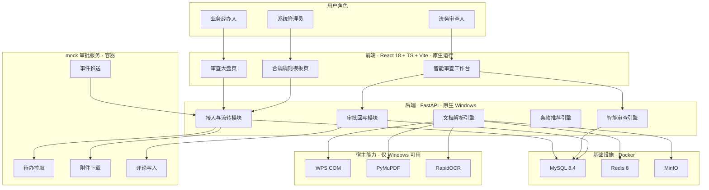
```mermaid
flowchart TB
    subgraph ACTOR["用户角色"]
        A1["法务审查人"]
        A2["业务经办人"]
        A3["系统管理员"]
    end

    subgraph FE["前端 · React 18 + TS + Vite · 原生运行"]
        F1["审查大盘页"]
        F2["智能审查工作台"]
        F3["合规规则模板页"]
    end

    subgraph BE["后端 · FastAPI · 原生 Windows"]
        B1["接入与流转模块"]
        B2["文档解析引擎"]
        B3["智能审查引擎"]
        B4["条款推荐引擎"]
        B5["审批回写模块"]
    end

    subgraph MOCK["mock 审批服务 · 容器"]
        M1["待办拉取"]
        M2["附件下载"]
        M3["评论写入"]
        M4["事件推送"]
    end

    subgraph INFRA["基础设施 · Docker"]
        I1["MySQL 8.4"]
        I2["Redis 8"]
        I3["MinIO"]
    end

    subgraph HOST["宿主能力 · 仅 Windows 可用"]
        H1["WPS COM"]
        H2["PyMuPDF"]
        H3["RapidOCR"]
    end

    A1 --> F2
    A2 --> F1
    A3 --> F3
    F1 --> B1
    F2 --> B3
    F2 --> B5
    F3 --> B1

    B1 --> M1
    B1 --> M2
    B5 --> M3
    M4 --> B1

    B2 --> H1
    B2 --> H2
    B2 --> H3

    B1 --> I1
    B2 --> I2
    B2 --> I3
    B3 --> I1
    B5 --> I1
```

**分层职责**

| 层 | 职责 | 关键约束 |
|---|---|---|
| 前端 | 交互与渲染 | 统一 PDF.js 渲染，一套坐标系统 |
| 后端 | 编排与业务 | 原生运行，可调用宿主 COM |
| mock 审批 | 扮演外部系统 | 与后端**不共享代码**，仅通过 HTTP 契约耦合 |
| 基础设施 | 数据与存储 | 容器化，端口与宿主实例错开 |
| 宿主能力 | 重依赖解析 | Windows 专有，**不可容器化** |

---

## 4. 部署架构

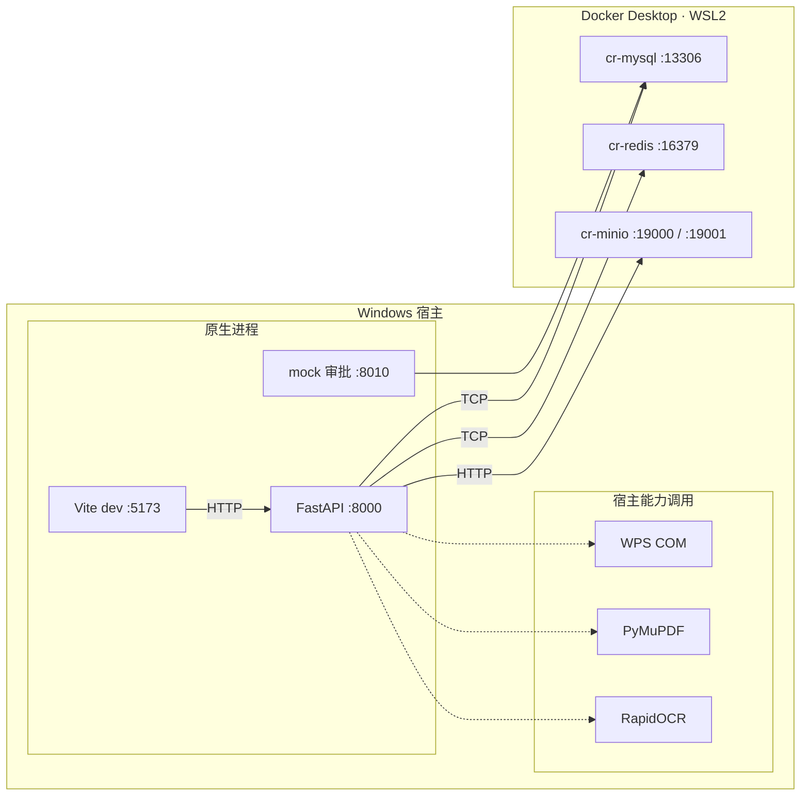
```mermaid
flowchart LR
    subgraph WIN["Windows 宿主"]
        direction TB
        subgraph NATIVE["原生进程"]
            N1["FastAPI :8000"]
            N2["mock 审批 :8010"]
            N3["Vite dev :5173"]
        end
        subgraph HOSTCAP["宿主能力调用"]
            C1["WPS COM"]
            C2["PyMuPDF"]
            C3["RapidOCR"]
        end
        N1 -.-> C1
        N1 -.-> C2
        N1 -.-> C3
    end

    subgraph DOCKER["Docker Desktop · WSL2"]
        direction TB
        D1["cr-mysql :13306"]
        D2["cr-redis :16379"]
        D3["cr-minio :19000 / :19001"]
    end

    N1 -->|"TCP"| D1
    N1 -->|"TCP"| D2
    N1 -->|"HTTP"| D3
    N2 --> D1
    N3 -->|"HTTP"| N1
```

**端口规划**（刻意错开本机 FlyEnv 实例，两套并存互不干扰）

| 服务 | 本项目端口 | 本机 FlyEnv 端口 | 说明 |
|---|---|---|---|
| MySQL | `13306` | `3306` | 隔离，避免污染 20 个既有库 |
| Redis | `16379` | `6379` | 隔离 |
| MinIO | `19000` / `19001` | — | API / Console |
| 后端 | `8000` | — | 原生 |
| mock 审批 | `8010` | — | 原生 |
| 前端 dev | `5173` | — | Vite |

**容器资源实测**（WSL2 默认配额）

| 项 | 值 |
|---|---|
| 可用 CPU | 12 核（Ryzen 5 5600H 全部） |
| 可用内存 | 7.87 GB（宿主 15.86 GB 的 50%） |
| 启动耗时 | 19 秒达 3/3 healthy |

**一键启动**：`python scripts/start_all.py`（`--open` 顺带开浏览器）。
按"前置检查 → 容器 healthy 等待 → alembic 建表 → 种子数据 → 三个服务探活"顺序执行，
已就绪的环节自动跳过（幂等）。停止用 `python scripts/stop_all.py`（`--infra` 连容器一起停）。

> 停止脚本只终止 `.run/*.json` 记录过的 PID；记录缺失时按端口反查，
> 且要求命令行同时含 `uvicorn`/`vite` 与 `--port <端口>` 才认定为本项目进程，
> 避免误杀恰好占用同端口的无关服务。

---

## 5. 文档解析引擎

### 5.1 四条输入路径

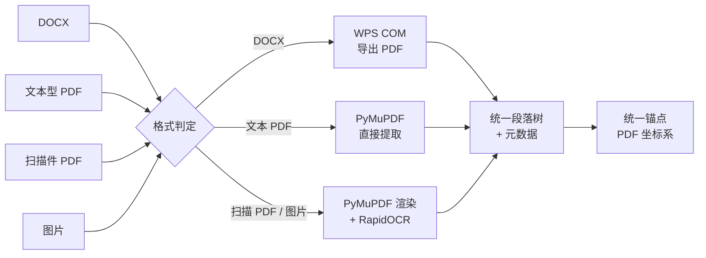
```mermaid
flowchart LR
    IN1["DOCX"] --> R1{"格式判定"}
    IN2["文本型 PDF"] --> R1
    IN3["扫描件 PDF"] --> R1
    IN4["图片"] --> R1

    R1 -->|"DOCX"| P1["WPS COM<br/>导出 PDF"]
    R1 -->|"文本 PDF"| P2["PyMuPDF<br/>直接提取"]
    R1 -->|"扫描 PDF / 图片"| P3["PyMuPDF 渲染<br/>+ RapidOCR"]

    P1 --> U["统一段落树<br/>+ 元数据"]
    P2 --> U
    P3 --> U
    U --> A["统一锚点<br/>PDF 坐标系"]
```

### 5.2 各路径实测数据

| 路径 | 方案 | 耗时 | 页码来源 | 字符级 bbox |
|---|---|---|---|---|
| 文本 PDF | PyMuPDF `get_text("dict")` | **9.26 ms** / 3 页 | `page.number` | ✅ `rawdict` 的 `span["chars"]` |
| DOCX | WPS COM → PDF | **1.41 s**（启动0.82+加载0.34+导出0.25） | WPS 排版结果 | ✅ 同文本 PDF |
| 扫描件 | 渲染 200 DPI + RapidOCR | **6.08 s** / 页 | `page.number` | ✅ 4 点多边形 |
| 图片 | 先包成 PDF 再走扫描件路径 | 同上 | 同上 | ✅ |

### 5.3 关键约束

> ⚠️ **DOCX 文件本身不含分页信息。**
> 证据：`<w:pageBreak>` = 0、`<w:lastRenderedPageBreak>` = 0、python-docx 无页码 API。
> 真实页码必须由排版引擎渲染后才可知。

> ⚠️ **WPS 与 LibreOffice 分页结果不一致。**
> 实测同一份 DOCX：WPS = 3 页，LibreOffice = 2 页（字体度量差异导致断行不同）。
> **本项目以 WPS 为准**，因为它是本机实际使用的办公软件，用户所见即所得。

> ⚠️ **OCR 会丢失表格结构。**
> 实测扫描件表格页识别为 `4自动输送线CL-X1201152,000.00152,000.00`（数字粘连）。
> 对策：扫描件来源的元数据**打置信度标记**，UI 提示"OCR 识别，请人工核对"。

### 5.4 DOCX 转换器可插拔设计

WPS COM 依赖**交互式桌面会话**，若后端跑成 Windows 服务（无桌面）会失败。
因此设计为策略模式：

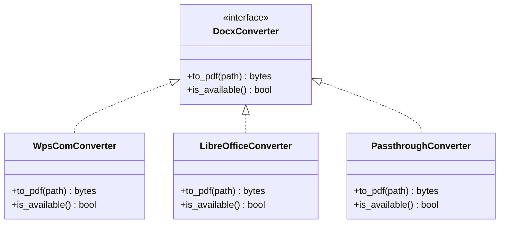
```mermaid
classDiagram
    class DocxConverter {
        <<interface>>
        +to_pdf(path) bytes
        +is_available() bool
    }
    class WpsComConverter {
        +to_pdf(path) bytes
        +is_available() bool
    }
    class LibreOfficeConverter {
        +to_pdf(path) bytes
        +is_available() bool
    }
    class PassthroughConverter {
        +to_pdf(path) bytes
        +is_available() bool
    }
    DocxConverter <|.. WpsComConverter
    DocxConverter <|.. LibreOfficeConverter
    DocxConverter <|.. PassthroughConverter
```

| 实现 | 可用条件 | 分页语义 |
|---|---|---|
| `WpsComConverter` | Windows + WPS + 交互式桌面 | WPS 排版（**首选**） |
| `LibreOfficeConverter` | 装了 LibreOffice | LO 排版（与 WPS 可能不同） |
| `PassthroughConverter` | 总是可用 | **无分页**，降级为段落级锚点 |

**降级链**：`WPS COM` → `LibreOffice` → `Passthrough`（段落级）。
任一环节失败时记录原因，**不静默降级**。

---

## 6. 统一锚点模型

### 6.1 设计原则

四条输入路径全部收敛到 **PDF 坐标系**，前端只需**一套渲染路径**。

```
DOCX ──(WPS COM)──┐
文本 PDF ──────────┼──→ PDF ──→ { page, bbox } + 可选 char_range
扫描 PDF ──────────┤            ↑
图片 ──(包成PDF)───┘      前端 PDF.js 统一渲染
```

### 6.2 数据结构

```json
{
  "page": 1,
  "bbox": [189.5, 58.96, 405.5, 82.7],
  "char_range": [0, 12],
  "source": "native_text",
  "confidence": 1.0
}
```

| 字段 | 必需 | 说明 |
|---|---|---|
| `page` | ✅ | 页码，从 1 开始 |
| `bbox` | ✅ | `[x0, y0, x1, y1]`，**PDF point 坐标**（非像素） |
| `char_range` | ❌ | 文本层中的字符区间；**扫描件为 `null`** |
| `source` | ✅ | `native_text` / `ocr` |
| `confidence` | ❌ | OCR 时为识别置信度，文本层为 `1.0` |

**关键点**：`bbox` 是唯一必需字段，`char_range` 可空。这解决了
"扫描件没有字符层"与"PRD 要求记录字符位置"之间的矛盾。

### 6.3 坐标映射（已实测验证）

```
OCR 像素坐标 × (72 / DPI) = PDF point 坐标
```

实测误差（OCR 框左上角 vs 原生文本行框左上角）：

| 文字 | OCR 像素 | 换算 PDF 坐标 | 原生 search_for | 误差 (pt) |
|---|---|---|---|---|
| 设备采购合 | (527.1, 178.0) | (189.8, 64.1) | (189.5, 59.0) | (0.3, 5.1) |
| 合同编号： | (475.5, 264.1) | (171.2, 95.1) | (171.0, 92.9) | (0.2, 2.2) |
| 甲方（采购 | (180.8, 326.6) | (65.1, 117.6) | (64.0, 114.4) | (1.1, 3.2) |

误差 0.2~5.1 pt，属 OCR 检测框 padding 的正常范围，**映射成立**。

### 6.4 引用对齐（LLM 输出 → 锚点）

LLM 返回的原文引用可能改标点、省略号、全半角混用，因此采用三级策略：

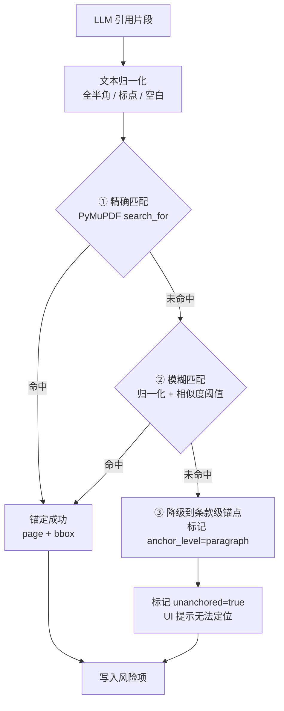
```mermaid
flowchart TD
    S["LLM 引用片段"] --> N["文本归一化<br/>全半角 / 标点 / 空白"]
    N --> M1{"① 精确匹配<br/>PyMuPDF search_for"}
    M1 -->|命中| OK["锚定成功<br/>page + bbox"]
    M1 -->|未命中| M2{"② 模糊匹配<br/>归一化 + 相似度阈值"}
    M2 -->|命中| OK
    M2 -->|未命中| M3["③ 降级到条款级锚点<br/>标记 anchor_level=paragraph"]
    M3 --> W["标记 unanchored=true<br/>UI 提示无法定位"]
    OK --> END["写入风险项"]
    W --> END
```

**核心原则**：引用无法定位时**必须显式标记**，绝不静默丢弃，也不伪造位置。
这是验收标准"原文与风险卡片双向高亮跳转"的兜底。

---

## 7. 任务状态机

### 7.1 任务状态

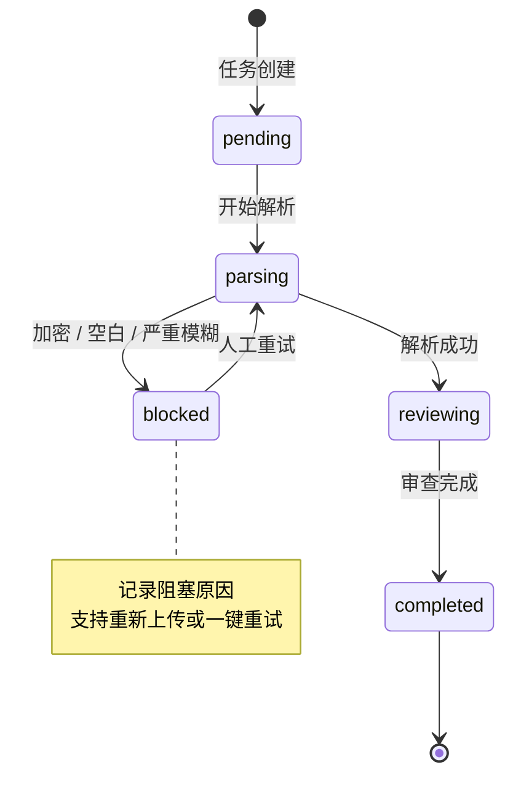
```mermaid
stateDiagram-v2
    [*] --> pending : 任务创建
    pending --> parsing : 开始解析
    parsing --> reviewing : 解析成功
    parsing --> blocked : 加密 / 空白 / 严重模糊
    reviewing --> completed : 审查完成
    blocked --> parsing : 人工重试
    completed --> [*]

    note right of blocked
        记录阻塞原因
        支持重新上传或一键重试
    end note
```

| 状态 | 含义 | 进入条件 |
|---|---|---|
| `pending` | 待处理 | 任务创建 |
| `parsing` | 解析中 | 开始解析（扫描件 CPU OCR 为分钟级，故进度需上报） |
| `reviewing` | 审查中 | 解析成功，进入规则+LLM 审查 |
| `blocked` | 解析受阻 | 文档加密 / 正文为空 / 扫描件严重模糊 |
| `completed` | 审查完成 | 审查完成，风险项已落库 |

### 7.2 回写状态

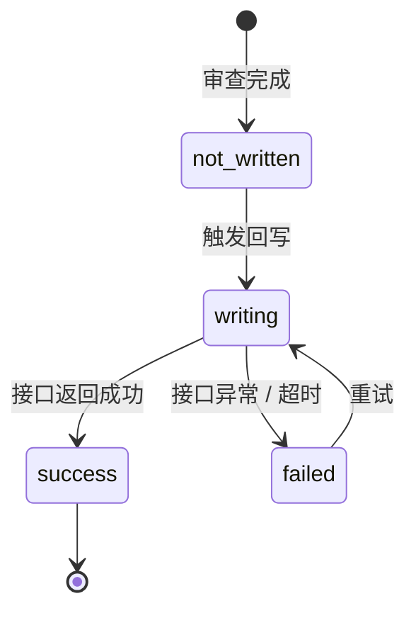
```mermaid
stateDiagram-v2
    [*] --> not_written : 审查完成
    not_written --> writing : 触发回写
    writing --> success : 接口返回成功
    writing --> failed : 接口异常 / 超时
    failed --> writing : 重试
    success --> [*]
```

### 7.3 阻塞超时策略

> ⚠️ 本地 CPU OCR 为**分钟级**，超时阈值**不能写死**。

```
timeout = base_timeout + per_page_timeout × page_count
```

| 参数 | 建议值 | 依据 |
|---|---|---|
| `base_timeout` | 60 s | 文件下载 + 引擎初始化（RapidOCR 初始化实测 2.40 s） |
| `per_page_timeout` | 30 s | 单页 OCR 实测 6.08 s，留 5× 余量应对复杂版面 |

同时解析过程**上报真实进度**（`已处理 3/12 页`），避免前端干等。

> ⚠️ **本策略当前尚未接线**：`dispatcher.compute_timeout()` 与
> `state_machine.mark_stale_tasks()` 都已实现，但**全仓无生产调用点**
> （仅测试引用），`.env` 的 `WPS_COM_TIMEOUT` 同样无人读取（R11）。
> 根因是 `win32com` 的 COM 调用**无法被安全中断**——超时逻辑只能事后标记，
> 拦不住已卡死的线程，修法涉及并发/线程设计，故留待决策，不在批次 8 范围内。

---

## 8. 智能审查引擎

### 8.1 双引擎协作

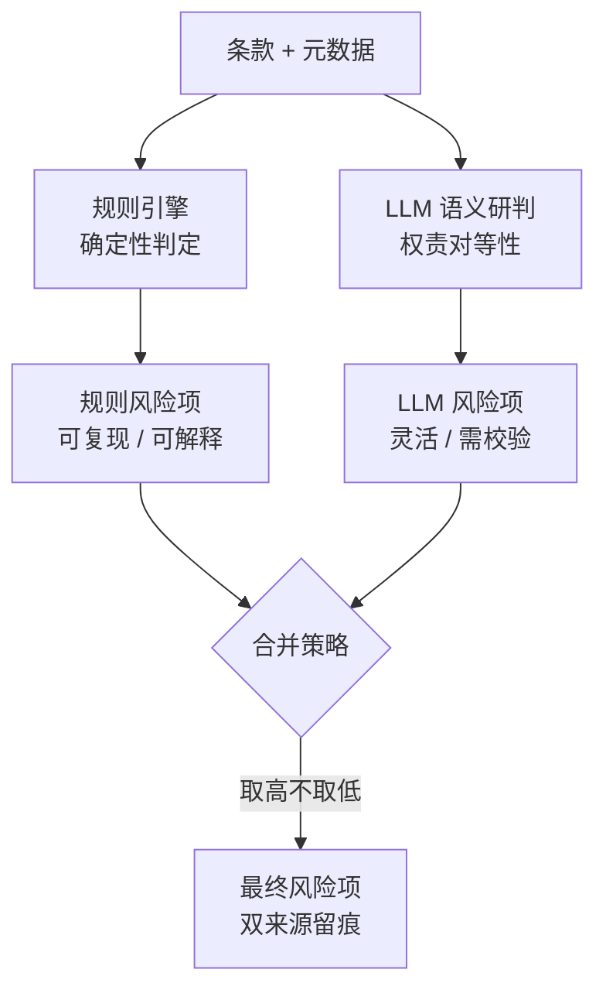
```mermaid
flowchart TB
    IN["条款 + 元数据"] --> RULE["规则引擎<br/>确定性判定"]
    IN --> LLM["LLM 语义研判<br/>权责对等性"]

    RULE --> RR["规则风险项<br/>可复现 / 可解释"]
    LLM --> LR["LLM 风险项<br/>灵活 / 需校验"]

    RR --> MERGE{"合并策略"}
    LR --> MERGE
    MERGE -->|"取高不取低"| FINAL["最终风险项<br/>双来源留痕"]
```

### 8.2 职责边界

| 引擎 | 负责 | 特点 |
|---|---|---|
| **规则引擎** | 金额、违约金比例、试用期工资比例、管辖地关键词、必备条款存在性、主体黑名单、**违约责任不对等** | 可复现、可解释、能进报告当"法律依据" |
| **LLM** | 权责是否对等、表述是否高危、条款语义冲突 | 灵活，但需防幻觉 |

> 各 metric（`penalty_ratio` / `amount` / `probation_pay_ratio` / `liability_asymmetry`）
> 的判定语义与取舍见 §18.2.5。

### 8.3 冲突合并策略：取高不取低

> **依据**：法律审查场景中"漏报"比"误报"代价大得多，取高是安全侧；
> 同时两个来源都留痕，报告里能写清"规则命中 + AI 研判"两条依据，可解释性保住。

示例：

```
合同写「违约金为合同总额的 25%」
  → 规则表阈值 20% → 规则判 中风险
  → LLM 读到上下文（我方弱势 + 对方已逾期 3 次）→ LLM 判 高风险
  → 最终 = 高风险（取高），报告呈现两条依据
```

### 8.4 风险等级判定

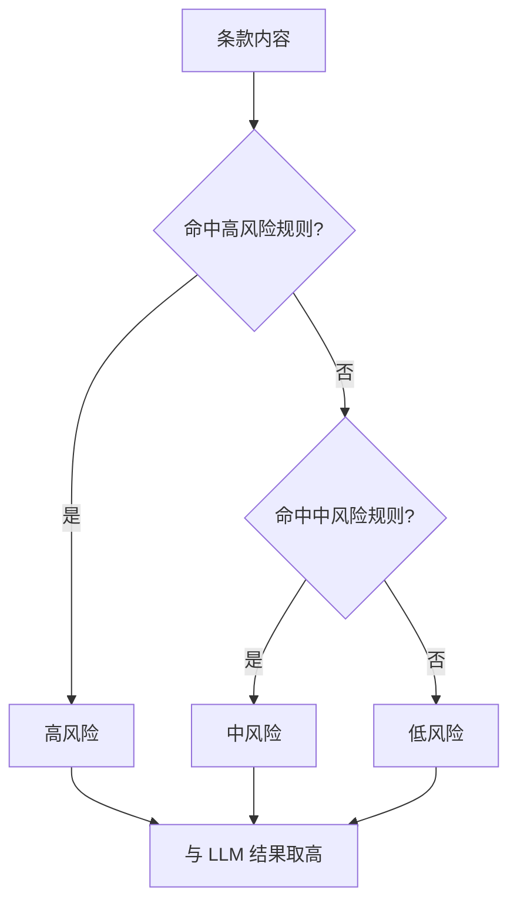
```mermaid
flowchart TD
    C["条款内容"] --> H{"命中高风险规则?"}
    H -->|是| RH["高风险"]
    H -->|否| M{"命中中风险规则?"}
    M -->|是| RM["中风险"]
    M -->|否| RL["低风险"]
    RH --> MERGE["与 LLM 结果取高"]
    RM --> MERGE
    RL --> MERGE
```

**高风险触发条件**（任一命中）

- 主体信息缺失或被列入经营异常
- 违约责任严重不对等（如我方单方承担无限责任）
- 管辖地约定违规
- 未设置付款前置验收条件

**中风险触发条件**（任一命中）

- 缺少保密义务期限
- 未明确不可抗力通知时效
- 违约金比例超出阈值

### 8.5 可配置阈值表

> ⚠️ **以下为演示用拟值，不是法律意见。实际使用必须由法务校准。**

| 规则项 | 阈值 / 判定清单 | 风险等级 |
|---|---|---|
| 违约金比例上限 | 20%（PRD 举例值，保守） | 超限 → 中风险 |
| 管辖地违规清单 | 境外仲裁机构 / 约定对方所在地法院 / 排除我方所在地管辖 | 命中 → 高风险 |
| 付款前置验收 | 必须存在"验收"相关条款 | 缺失 → 高风险 |
| 保密义务期限 | 必须明确期限 | 缺失 → 中风险 |
| 不可抗力通知时效 | 必须明确时效 | 缺失 → 中风险 |
| 试用期工资比例 | 不得低于约定工资的 80%（《劳动合同法》第二十条） | 低于 → 高风险 |
| 违约责任不对等 | 全文并存"重责侧表述"（全部损失 / 无上限）与"轻责侧表述"（万分之一 / 累计不超过，或比例 ≤ 5%） | 并存 → 高风险 |

> 后两行随批次 9 新增（见 §18.2.5）：试用期工资比例是**劳动类**规则，
> 违约责任不对等是**销售/采购类**规则。"不对等"用的是**关键词并存的启发式**，
> 不做当事人方向的语义理解，理由与局限见 §18.2.5。

### 8.6 必备条款全局校验

> ⚠️ **长合同分块后，"必备条款缺失"是全局判断**，单块审查天然看不见。

因此审查分两层：

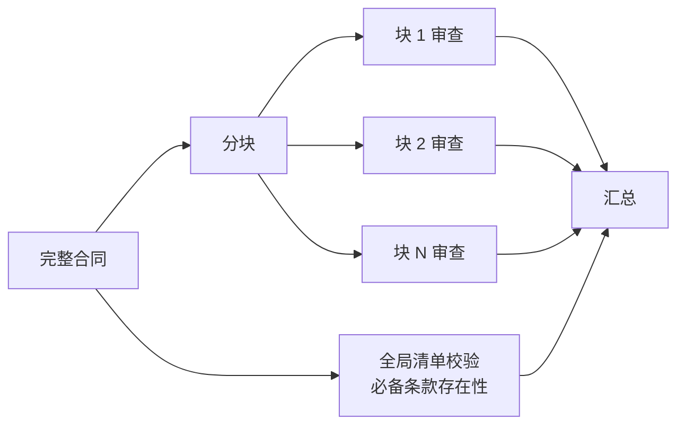
```mermaid
flowchart LR
    DOC["完整合同"] --> SPLIT["分块"]
    SPLIT --> C1["块 1 审查"]
    SPLIT --> C2["块 2 审查"]
    SPLIT --> C3["块 N 审查"]
    DOC --> GLOBAL["全局清单校验<br/>必备条款存在性"]
    C1 --> MERGE["汇总"]
    C2 --> MERGE
    C3 --> MERGE
    GLOBAL --> MERGE
```

### 8.7 防幻觉闸门

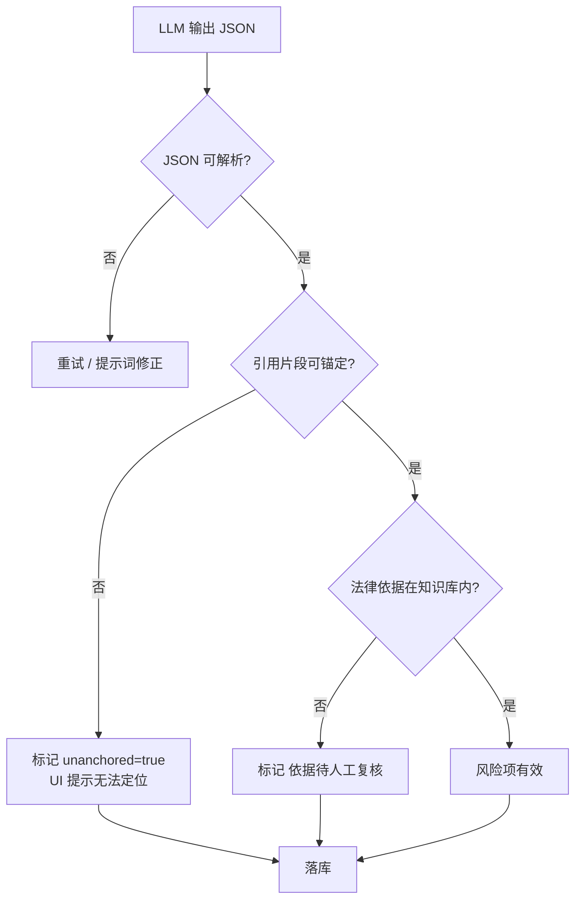
```mermaid
flowchart TD
    LLM["LLM 输出 JSON"] --> V1{"JSON 可解析?"}
    V1 -->|否| RETRY["重试 / 提示词修正"]
    V1 -->|是| V2{"引用片段可锚定?"}
    V2 -->|否| UN["标记 unanchored=true<br/>UI 提示无法定位"]
    V2 -->|是| V3{"法律依据在知识库内?"}
    V3 -->|否| WARN["标记 依据待人工复核"]
    V3 -->|是| OK["风险项有效"]
    UN --> SAVE["落库"]
    WARN --> SAVE
    OK --> SAVE
```

**三条硬规则**

1. **JSON 解析失败必须重试或报错**，不能返回半成品
2. **引用无法锚定的风险项必须标记**，不能当作正常结果
3. **法律依据要么限定知识库选取，要么显式标注"AI 生成，需人工复核"**

---

## 9. LLM Provider 抽象

### 9.1 接口设计

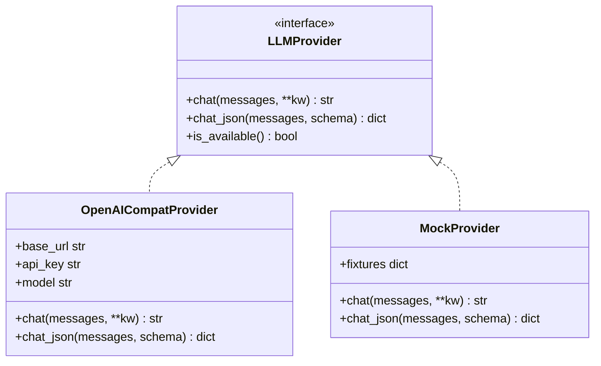
```mermaid
classDiagram
    class LLMProvider {
        <<interface>>
        +chat(messages, **kw) str
        +chat_json(messages, schema) dict
        +is_available() bool
    }
    class OpenAICompatProvider {
        +base_url str
        +api_key str
        +model str
        +chat(messages, **kw) str
        +chat_json(messages, schema) dict
    }
    class MockProvider {
        +fixtures dict
        +chat(messages, **kw) str
        +chat_json(messages, schema) dict
    }
    LLMProvider <|.. OpenAICompatProvider
    LLMProvider <|.. MockProvider
```

### 9.2 为什么只用两个实现

`OpenAICompatProvider` 用 `openai` 库的自定义 `base_url`，**一套代码兼容**：
DeepSeek / 通义 / 智谱 / Kimi / 硅基流动 / 自建 vLLM / Ollama。

**不引入额外 SDK**，符合 AGENTS"禁止擅自引入新第三方依赖"。

### 9.3 配置

```env
LLM_PROVIDER=mock              # mock | openai_compat
LLM_BASE_URL=                  # 如 https://api.deepseek.com/v1
LLM_API_KEY=
LLM_MODEL=
```

**默认 `mock`**：无 Key 时演示仍能完整跑通全链路。
`MockProvider` 回放预置审查结果（带完整依据链），UI 明确标注「模拟输出」。

### 9.4 JSON 输出兜底

> ⚠️ 若接口不支持 `response_format: {"type": "json_object"}`，
> 需要「JSON 提取 + 校验 + 重试」三层兜底，不能让 LLM 输出格式把整条链路搞挂。


```mermaid
flowchart LR
    P["提示词约束<br/>要求输出 JSON"] --> C1["原生 JSON 模式<br/>若支持"]
    C1 --> C2["正则提取 JSON 代码块"]
    C2 --> C3["schema 校验<br/>Pydantic"]
    C3 -->|失败| C4["重试 + 错误反馈<br/>最多 N 次"]
    C3 -->|成功| OUT["结构化结果"]
    C4 --> OUT
```

---

## 10. 数据模型

### 10.1 ER 图

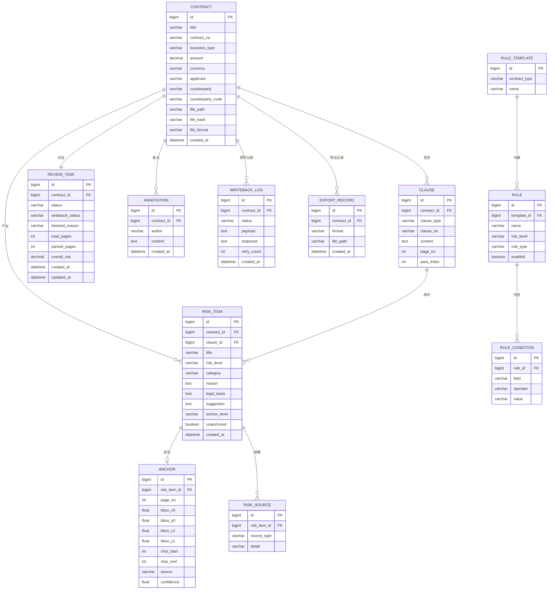
```mermaid
erDiagram
    CONTRACT ||--o{ CLAUSE : "包含"
    CONTRACT ||--o{ RISK_ITEM : "产生"
    CONTRACT ||--|| REVIEW_TASK : "对应"
    CLAUSE ||--o{ RISK_ITEM : "命中"
    RISK_ITEM ||--o| ANCHOR : "定位"
    RISK_ITEM ||--o{ RISK_SOURCE : "依据"
    CONTRACT ||--o{ ANNOTATION : "批注"
    CONTRACT ||--o{ WRITEBACK_LOG : "回写记录"
    CONTRACT ||--o{ EXPORT_RECORD : "导出记录"
    RULE ||--o{ RULE_CONDITION : "包含"
    RULE_TEMPLATE ||--o{ RULE : "归类"

    CONTRACT {
        bigint id PK
        varchar title
        varchar contract_no
        varchar business_type
        decimal amount
        varchar currency
        varchar applicant
        varchar counterparty
        varchar counterparty_code
        varchar file_path
        varchar file_hash
        varchar file_format
        datetime created_at
    }
    REVIEW_TASK {
        bigint id PK
        bigint contract_id FK
        varchar status
        varchar writeback_status
        varchar blocked_reason
        int total_pages
        int parsed_pages
        decimal overall_risk
        datetime created_at
        datetime updated_at
    }
    CLAUSE {
        bigint id PK
        bigint contract_id FK
        varchar clause_type
        varchar clause_no
        text content
        int page_no
        int para_index
    }
    RISK_ITEM {
        bigint id PK
        bigint contract_id FK
        bigint clause_id FK
        varchar title
        varchar risk_level
        varchar category
        text reason
        text legal_basis
        text suggestion
        varchar anchor_level
        boolean unanchored
        datetime created_at
    }
    ANCHOR {
        bigint id PK
        bigint risk_item_id FK
        int page_no
        float bbox_x0
        float bbox_y0
        float bbox_x1
        float bbox_y1
        int char_start
        int char_end
        varchar source
        float confidence
    }
    RISK_SOURCE {
        bigint id PK
        bigint risk_item_id FK
        varchar source_type
        varchar detail
    }
    ANNOTATION {
        bigint id PK
        bigint contract_id FK
        varchar author
        text content
        datetime created_at
    }
    WRITEBACK_LOG {
        bigint id PK
        bigint contract_id FK
        varchar status
        text payload
        text response
        int retry_count
        datetime created_at
    }
    RULE_TEMPLATE {
        bigint id PK
        varchar contract_type
        varchar name
    }
    RULE {
        bigint id PK
        bigint template_id FK
        varchar name
        varchar risk_level
        varchar rule_type
        boolean enabled
    }
    RULE_CONDITION {
        bigint id PK
        bigint rule_id FK
        varchar field
        varchar operator
        varchar value
    }
    EXPORT_RECORD {
        bigint id PK
        bigint contract_id FK
        varchar format
        varchar file_path
        datetime created_at
    }
```

### 10.2 存储划分

| 数据 | 存储位置 | 理由 |
|---|---|---|
| 合同原件 | **MinIO** | 大文件不进 DB |
| 导出报告 | **MinIO** | 同上 |
| 段落树 + 锚点 | **MySQL** | 需查询与关联 |
| 全文 | **不单独存**（存于 CLAUSE） | 避免 LONGTEXT 拖慢查询 |
| 解析进度 | **Redis** | 高频更新 |
| OCR 结果缓存 | **Redis** | 按文件 hash 缓存，避免重复 6s/页 |

### 10.3 字符集与严格模式

> ⚠️ 本机 FlyEnv 实例的 `sql-mode = NO_ENGINE_SUBSTITUTION`（非严格模式），
> 合同金额溢出、超长文本会**静默截断**。容器实例已修正：

```ini
--character-set-server=utf8mb4
--collation-server=utf8mb4_0900_ai_ci
--sql-mode=STRICT_TRANS_TABLES,NO_ENGINE_SUBSTITUTION
--default-time-zone=+08:00
```

实测验证：生僻字（`龘靐齉爩`）、emoji（`📄✅🔍`）、特殊符号（`㎡ № ℡ ㈠`）
全部正确存储，4 字节字符 `24 bytes / 8 chars` 校验通过。

---

## 11. 核心业务流程

### 11.1 审批触发与自动审查

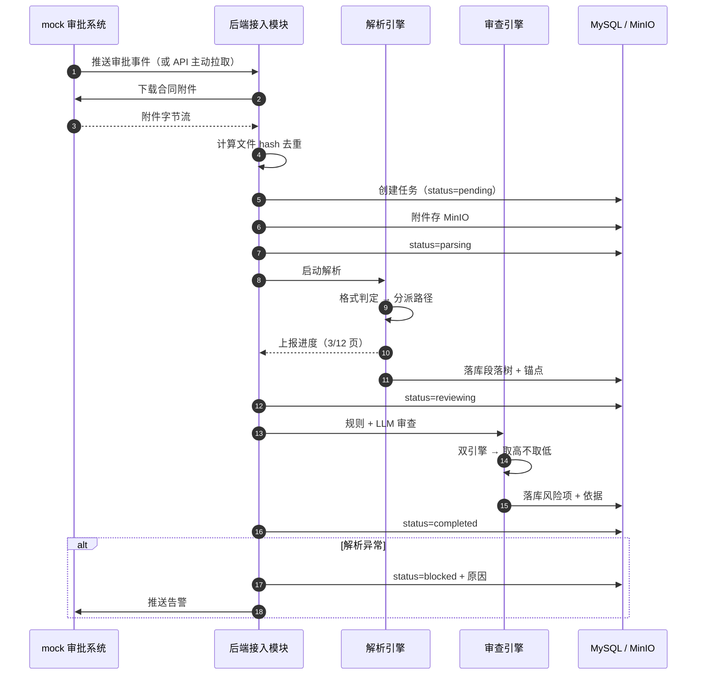
```mermaid
sequenceDiagram
    autonumber
    participant MOCK as mock 审批系统
    participant API as 后端接入模块
    participant PARSE as 解析引擎
    participant REVIEW as 审查引擎
    participant DB as MySQL / MinIO

    MOCK->>API: 推送审批事件（或 API 主动拉取）
    API->>MOCK: 下载合同附件
    MOCK-->>API: 附件字节流
    API->>API: 计算文件 hash 去重
    API->>DB: 创建任务（status=pending）
    API->>DB: 附件存 MinIO
    API->>DB: status=parsing

    API->>PARSE: 启动解析
    PARSE->>PARSE: 格式判定 → 分派路径
    PARSE-->>API: 上报进度（3/12 页）
    PARSE->>DB: 落库段落树 + 锚点
    API->>DB: status=reviewing

    API->>REVIEW: 规则 + LLM 审查
    REVIEW->>REVIEW: 双引擎 → 取高不取低
    REVIEW->>DB: 落库风险项 + 依据
    API->>DB: status=completed

    alt 解析异常
        API->>DB: status=blocked + 原因
        API->>MOCK: 推送告警
    end
```

### 11.2 法务人工复核与协同改写

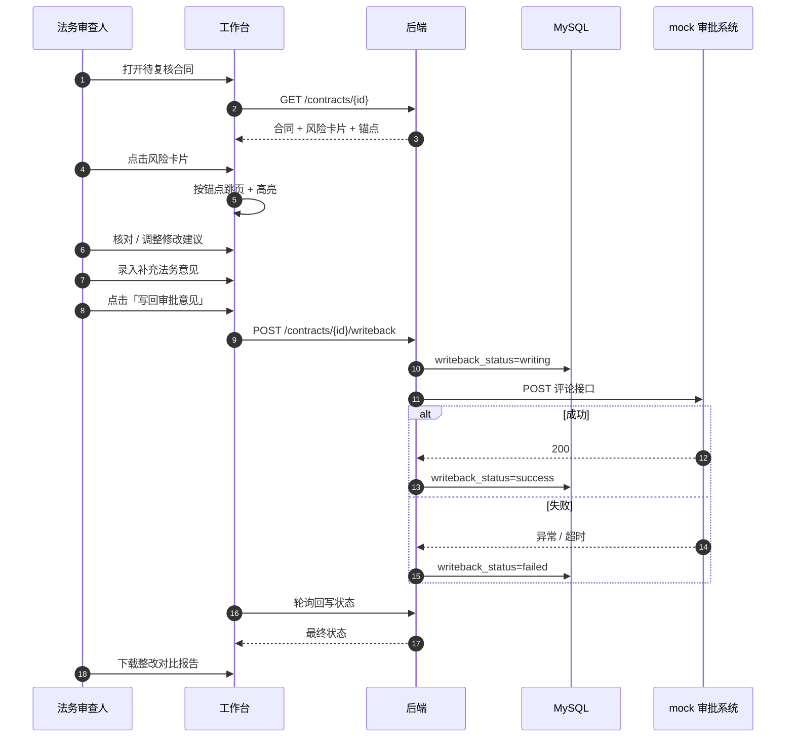
```mermaid
sequenceDiagram
    autonumber
    participant LAW as 法务审查人
    participant FE as 工作台
    participant API as 后端
    participant DB as MySQL
    participant MOCK as mock 审批系统

    LAW->>FE: 打开待复核合同
    FE->>API: GET /contracts/{id}
    API-->>FE: 合同 + 风险卡片 + 锚点
    LAW->>FE: 点击风险卡片
    FE->>FE: 按锚点跳页 + 高亮
    LAW->>FE: 核对 / 调整修改建议
    LAW->>FE: 录入补充法务意见
    LAW->>FE: 点击「写回审批意见」
    FE->>API: POST /contracts/{id}/writeback
    API->>DB: writeback_status=writing
    API->>MOCK: POST 评论接口
    alt 成功
        MOCK-->>API: 200
        API->>DB: writeback_status=success
    else 失败
        MOCK-->>API: 异常 / 超时
        API->>DB: writeback_status=failed
    end
    FE->>API: 轮询回写状态
    API-->>FE: 最终状态
    LAW->>FE: 下载整改对比报告
```

### 11.3 异常任务阻塞与重试

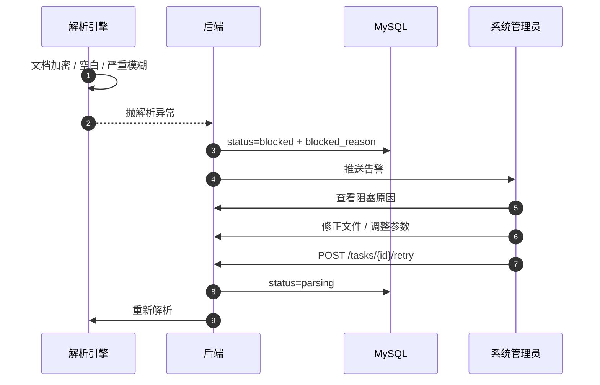
```mermaid
sequenceDiagram
    autonumber
    participant PARSE as 解析引擎
    participant API as 后端
    participant DB as MySQL
    participant ADMIN as 系统管理员

    PARSE->>PARSE: 文档加密 / 空白 / 严重模糊
    PARSE-->>API: 抛解析异常
    API->>DB: status=blocked + blocked_reason
    API->>ADMIN: 推送告警
    ADMIN->>API: 查看阻塞原因
    ADMIN->>API: 修正文件 / 调整参数
    ADMIN->>API: POST /tasks/{id}/retry
    API->>DB: status=parsing
    API->>PARSE: 重新解析
```

### 11.4 前端交互（工作台）

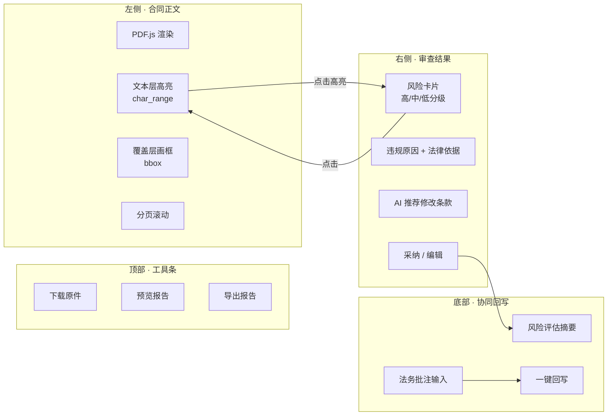
```mermaid
flowchart LR
    subgraph TOP["顶部 · 工具条"]
        T1["下载原件"]
        T2["预览报告"]
        T3["导出报告"]
    end

    subgraph LEFT["左侧 · 合同正文"]
        L1["PDF.js 渲染"]
        L2["文本层高亮<br/>char_range"]
        L3["覆盖层画框<br/>bbox"]
        L4["分页滚动"]
    end

    subgraph RIGHT["右侧 · 审查结果"]
        R1["风险卡片<br/>高/中/低分级"]
        R2["违规原因 + 法律依据"]
        R3["AI 推荐修改条款"]
        R4["采纳 / 编辑"]
    end

    subgraph BOTTOM["底部 · 协同回写"]
        B1["风险评估摘要"]
        B2["法务批注输入"]
        B3["一键回写"]
    end

    R1 -->|"点击"| L2
    L2 -->|"点击高亮"| R1
    R4 --> B1
    B2 --> B3
```

**双向锚定的实现要点**

- 风险卡片 → 正文：用 `page` 跳页，用 `bbox` 滚动到可视区并高亮
- 正文 → 风险卡片：文本层 span 携带 `risk_item_id`，点击反向定位卡片
- 扫描件无文本层：只用 `bbox` 覆盖层，点击命中检测用坐标范围

---

## 12. 后端模块划分

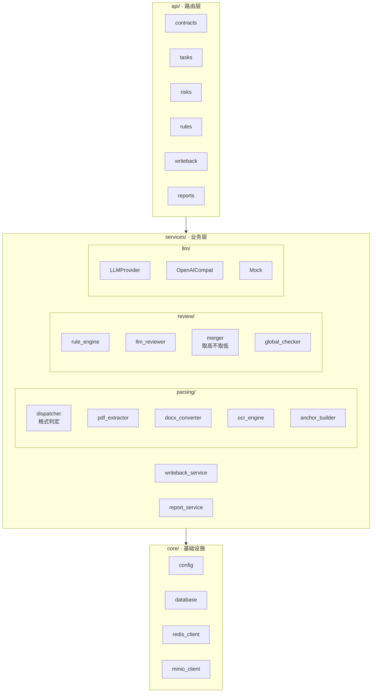
```mermaid
flowchart TB
    subgraph API["api/ · 路由层"]
        A1["contracts"]
        A2["tasks"]
        A3["risks"]
        A4["rules"]
        A5["writeback"]
        A6["reports"]
    end

    subgraph SVC["services/ · 业务层"]
        subgraph PARSING["parsing/"]
            P1["dispatcher<br/>格式判定"]
            P2["pdf_extractor"]
            P3["docx_converter"]
            P4["ocr_engine"]
            P5["anchor_builder"]
        end
        subgraph REVIEW["review/"]
            R1["rule_engine"]
            R2["llm_reviewer"]
            R3["merger<br/>取高不取低"]
            R4["global_checker"]
        end
        subgraph LLM["llm/"]
            L1["LLMProvider"]
            L2["OpenAICompat"]
            L3["Mock"]
        end
        S1["writeback_service"]
        S2["report_service"]
    end

    subgraph DATA["core/ · 基础设施"]
        D1["config"]
        D2["database"]
        D3["redis_client"]
        D4["minio_client"]
    end

    API --> SVC
    SVC --> DATA
```

**模块职责**

| 模块 | 职责 | 关键点 |
|---|---|---|
| `parsing/dispatcher` | 格式判定与路径分派 | 单一入口，避免调用方关心格式 |
| `parsing/docx_converter` | DOCX → PDF | 策略模式，三级降级 |
| `parsing/ocr_engine` | 扫描件 OCR + 行→块组装 | 结果缓存（按文件 hash）；块组装是条款切分的前提 |
| `parsing/anchor_builder` | 构建统一锚点 | 坐标映射的唯一实现点 |
| `review/rule_engine` | 确定性规则匹配 | 关键词匹配放应用层，**不下推给 DB** |
| `review/llm_reviewer` | LLM 语义研判 | 带防幻觉闸门 |
| `review/merger` | 双引擎合并 | 取高不取低，双来源留痕 |
| `review/global_checker` | 必备条款全局校验 | 弥补分块审查的盲区 |
| `llm/` | Provider 抽象 | 默认 Mock |

---

## 13. 异步任务设计

### 13.1 方案选择

**DB 状态机 + 进程内后台任务**（FastAPI `BackgroundTasks`）。

| 对比项 | 本方案 | Celery + Redis |
|---|---|---|
| 并发能力 | 弱（演示并发量为 1） | 强 |
| 依赖 | 无额外中间件 | 需 Celery + Redis |
| 演示失败点 | 少 | 多一个必须启动的服务 |
| 重启恢复 | 靠 `parsing` 状态恢复 | 内建 |

**结论**：阶段一用本方案。任务表设计成**可迁移的**，阶段二若需批量审查再迁 Celery。

### 13.2 任务执行流程

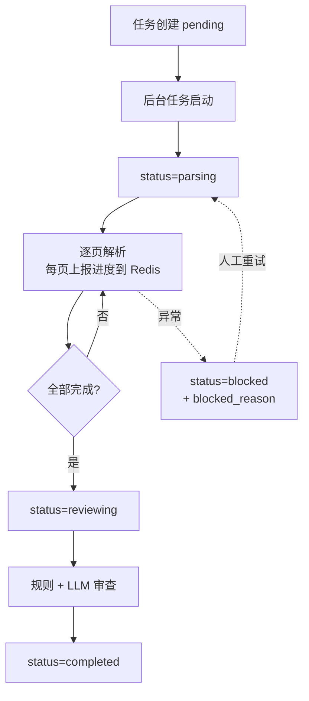
```mermaid
flowchart TD
    T["任务创建 pending"] --> W["后台任务启动"]
    W --> U["status=parsing"]
    U --> P["逐页解析<br/>每页上报进度到 Redis"]
    P --> CHK{"全部完成?"}
    CHK -->|否| P
    CHK -->|是| R["status=reviewing"]
    R --> REV["规则 + LLM 审查"]
    REV --> D["status=completed"]
    P -.->|异常| B["status=blocked<br/>+ blocked_reason"]
    B -.->|人工重试| U
```

### 13.3 幂等性

- 任务重试时**先清理旧的段落树与锚点**，避免重复数据
- 回写用 `writeback_log` 表记录，**同一合同重复触发时先查是否已 success**
- 文件去重用 `file_hash`，相同文件不重复解析（直接命中 OCR 缓存）

---

## 14. 前端架构

### 14.1 页面结构

```
┌───────────────────────────────────────────────────────────────┐
│  合同审查大盘页                                                │
│  ┌─────────────────────────────────────────────────────────┐  │
│  │ [风险筛选 ▾] [状态筛选 ▾]           [+ 上传合同]        │  │
│  ├─────────────────────────────────────────────────────────┤  │
│  │ 合同名称    申请人  业务类型  金额    状态   风险  时间  │  │
│  │ 设备采购…   张三    采购      229万   完成   高    09-26 │  │
│  │ 系统销售…   李四    销售      580万   审查中 中    09-26 │  │
│  │ 劳动合同…   王五    劳动      —       阻塞    —    09-26 │  │
│  └─────────────────────────────────────────────────────────┘  │
└───────────────────────────────────────────────────────────────┘

┌───────────────────────────────────────────────────────────────┐
│  智能审查工作台                                                │
│  [下载原件] [预览报告] [导出报告]                             │
│  ┌──────────────────────────┬──────────────────────────────┐  │
│  │ 合同正文（PDF.js）        │ 审查结果与建议                │  │
│  │ ┌──────────────────────┐ │ ┌──────────────────────────┐ │  │
│  │ │ 第 1 页 / 共 3 页     │ │ │ 🔴 高风险  知识产权归属   │ │  │
│  │ │                      │ │ │ 原因：…  依据：《民法典》…│ │  │
│  │ │  第二条 知识产权     │ │ │ 建议：双方共有 / 甲方所有 │ │  │
│  │ │  ▓▓▓▓▓▓▓▓▓▓▓▓  ←高亮 │ │ │ [采纳] [编辑] [复制]      │ │  │
│  │ │                      │ │ ├──────────────────────────┤ │  │
│  │ │  第四条 付款方式     │ │ │ 🟠 中风险  违约金比例     │ │  │
│  │ │  ▓▓▓▓▓▓▓▓▓▓▓▓  ←高亮 │ │ │ …                        │ │  │
│  │ │                      │ │ └──────────────────────────┘ │  │
│  │ │ [◀ 上一页] [下一页 ▶] │ │                              │  │
│  │ └──────────────────────┘ │ ┌──────────────────────────┐ │  │
│  │                          │ │ 综合风险：🔴 高            │ │  │
│  │                          │ │ 结论：建议整改后重审        │ │  │
│  │                          │ │ ┌──────────────────────┐ │ │  │
│  │                          │ │ │ 法务批注…            │ │ │  │
│  │                          │ │ └──────────────────────┘ │ │  │
│  │                          │ │ [写回审批意见]            │ │  │
│  │                          │ └──────────────────────────┘ │  │
│  └──────────────────────────┴──────────────────────────────┘  │
└───────────────────────────────────────────────────────────────┘

┌───────────────────────────────────────────────────────────────┐
│  合规规则与模板页                                              │
│  ┌──────────────┬──────────────────────────────────────────┐  │
│  │ 合同类型      │ 规则项列表                                │  │
│  │ ▸ 采购合同    │ ┌──────────────────────────────────────┐ │  │
│  │ ▸ 销售合同    │ │ 违约金比例上限  [中风险]  [启用 ✓]    │ │  │
│  │ ▸ 服务合同    │ │   条件: 违约金比例 > 20%              │ │  │
│  │ ▸ 劳动合同    │ │   示范条款: 违约金不超过总额 20%      │ │  │
│  │              │ ├──────────────────────────────────────┤ │  │
│  │              │ │ 管辖地约定      [高风险]  [启用 ✓]    │ │  │
│  │              │ │   条件: 命中违规清单                  │ │  │
│  │              │ └──────────────────────────────────────┘ │  │
│  └──────────────┴──────────────────────────────────────────┘  │
└───────────────────────────────────────────────────────────────┘
```

**实现范围**：三张图均已交付。合规规则与模板页随**批次 7** 交付
（§18.2.3）——规则库从只读升级为可维护，写入前经 `rule_config.validate_rule` 校验。

### 14.2 技术选型

| 项 | 选择 | 理由 |
|---|---|---|
| 框架 | React 18 + TypeScript | 类型安全 |
| 构建 | Vite | 开发期 HMR 快 |
| UI 库 | Ant Design | 表格/表单/树控件直接吃下大盘页与规则页 |
| 文档渲染 | **PDF.js** | 统一渲染，文本层 + 覆盖层 |
| 状态管理 | **React Query**（`@tanstack/react-query`） | 以服务端状态为主；审查进度轮询用 `refetchInterval` 即可，不必引全局 store |
| 请求 | axios / fetch | — |

### 14.3 为什么统一用 PDF.js

实测证明四条输入路径都能收敛到 PDF 坐标系（见 §6）。
因此前端**只需要一套渲染路径**：

- 文本层高亮（`char_range`）与覆盖层画框（`bbox`）**在同一坐标空间**
- 不需要为 DOCX 单独写 HTML 渲染，也不需要为扫描件单独写图片渲染

**代价**：DOCX 展示的是转换后的 PDF，不是原件排版；用户下载原件时页码可能对不上。
报告中将明确标注"页码基于 WPS 排版"。

---

## 15. 安全与合规

### 15.1 凭据管理

- 所有凭据走 `.env`，**不进 Git**（`.gitignore`）
- `compose.yml` 用 `${VAR}` 引用，不硬编码
- 提供 `.env.example` 作为模板

### 15.2 数据隔离

| 措施 | 说明 |
|---|---|
| 独立数据库实例 | 容器 MySQL，**不碰宿主 FlyEnv 的 20 个库** |
| 最小权限用户 | `GRANT ALL ON contract_review.*`，仅此一库 |
| 端口错开 | 13306/16379/19000，避免误连 |
| 文件 hash 去重 | 防止重复解析，也便于审计 |

### 15.3 LLM 数据外发

> ⚠️ 合同文本属于**敏感商业数据**，发送到第三方 LLM API 存在合规风险。

- 默认 `MockProvider`，**不外发任何数据**
- 启用真实 Provider 时，在 UI 明确提示"合同内容将发送至外部 LLM 服务"
- 演示用虚构合同，不含真实商业信息

### 15.4 示例合同命名

虚构合同中的公司名**不使用任何真实企业名**，一律用「示例科技有限公司」这类
明显虚构的命名，并在合同头部标注「本文档为演示用虚构样本」，
避免生成物被误当成真实合同或侵犯名称权。

---

## 16. 测试策略

### 16.1 测试范围

| 类型 | 内容 | 是否必需 |
|---|---|---|
| 核心业务逻辑 | 状态机流转、规则引擎判定、取高合并 | ✅ 必需 |
| 边界/错误路径 | 加密文档、空白文档、超长文本、OCR 失败 | ✅ 必需 |
| 外部集成 | LLM Provider、mock 审批、WPS COM（最小 Mock） | ✅ 必需 |
| 锚点对齐 | 引用定位的三级降级 | ✅ 必需 |
| 回归断言集 | 每份示例合同的期望风险点（采购 / 扫描件 / 销售 / 服务 / 劳动，共 5 份） | ✅ 必需 |
| 覆盖率导向的测试 | — | ❌ 不做 |
| 实现细节测试 | 具体颜色值、类名 | ❌ 不做 |

### 16.2 回归断言集设计

为每份示例合同人工标注**期望风险点**，落在 `samples/expected/*.expected.json`：

```json
{
  "contract": "设备采购合同-高风险样本.docx",
  "sample_dir": "purchase",
  "business_type": "purchase",
  "expected_overall": "high",
  "expected_conclusion": "reject",
  "expected_risks": [
    {
      "title": "知识产权归属供应商",
      "match_keywords": ["知识产权"],
      "risk_level": "high",
      "must_anchor": true,
      "expected_anchor_page": 1,
      "expected_anchor_level": "exact",
      "anchor_quote": "第八条知识产权本项目产生的知识产权归供应商所有。"
    }
  ]
}
```

**为什么用 `match_keywords` 而不是 `title` 做匹配**：规则引擎用 `rule.name`，
LLM 用自己的措辞，两者几乎不会一致（"违约责任无上限" vs "赔偿责任无上限"，
实测标题相似度仅 0.42~0.84）。`title` 只用于报告展示，
匹配判据是"实际风险项的 `title` / `reason` / `legal_basis` 拼接文本包含任一关键词"。

**断言维度**

| 维度 | 判据 |
|---|---|
| 风险点是否被识别（召回） | `match_keywords` 命中任一风险项 |
| 风险等级是否正确 | `risk_level` 相等 |
| 锚点是否定位到正确页码 | `must_anchor` 时 `page_no == expected_anchor_page` |
| 锚点级别是否符合预期 | `anchor_level == expected_anchor_level` |
| **锚点是否真的框住引用原文** | 用渲染用 PDF + PDF.js 实测 bbox 覆盖情况（`--verify-anchors`） |
| 综合风险等级 / 结论 | 与 `expected_overall` / `expected_conclusion` 相等 |

**锚点级别由规则类型决定**（实测规律）：

- KEYWORD / REGEX / BLACKLIST 类规则能提取命中子串 → `exact`，覆盖整段引用
- PRESENCE 类规则（"必须包含某模式"）没有命中子串 → `paragraph`，覆盖**整条条款**
  （按页切分，跨页条款产出多个锚点；锚定对象是整条而非子串，因此不带字符区间）

**最后一项为什么要走 PDF.js**：后端锚点由 PyMuPDF 产生，
用 PyMuPDF 自校验是同源验证，测不出"前端坐标换算公式错"。
实测该项曾抓到真实缺陷——用 `viewport.convertToViewportRectangle()`
（假定左下原点、会翻转 y）时 6 个锚点只有 1 个落在引用文字上；
改用左上原点直乘 scale 后 6/6 命中。

**执行方式**

```bash
python scripts/run_tests.py                    # 只校验风险识别与等级
python scripts/run_tests.py --verify-anchors   # 附加锚点坐标校验（需 node）
```

退出码 0 = 全部通过，可直接用于 CI 或提交前检查。

### 16.3 不做量化指标的理由

PRD 未提供真实工商数据源与真实审批系统，生产化的两个前置条件缺失。
搭带标注的评测集投入产出不划算；**断言集足以防止回归**。

---

## 17. 项目结构

```
contract-approval-and-review-system/
├── AGENTS.md                      # 项目规范
├── PRD.md                         # 需求文档
├── README.md                      # 快速开始
├── compose.yml                    # 基础设施编排（mysql/redis/minio）
├── .env.example                   # 环境变量模板
├── .env                           # 实际凭据（.gitignore）
├── .gitignore
│
├── docs/
│   ├── architecture.md            # 本文档
│   ├── data-model.md              # 数据对象设计
│   ├── data-layer-guide.md        # 数据层使用说明
│   ├── review-engine.md           # 审查引擎说明
│   ├── api-guide.md               # 后端 API 手册
│   └── mock-approval.md           # mock 审批系统说明
│
├── backend/                       # FastAPI · 原生运行
│   ├── app/
│   │   ├── main.py
│   │   ├── api/                   # 路由
│   │   ├── core/                  # config / database / redis / minio
│   │   ├── models/                # SQLAlchemy 模型
│   │   ├── schemas/               # Pydantic 模型
│   │   ├── services/
│   │   │   ├── parsing/           # dispatcher / pdf / docx / ocr / anchor
│   │   │   ├── review/            # clause_splitter / rule_engine / llm_reviewer
│   │   │   │                      #   / merger / global_checker
│   │   │   ├── llm/               # LLMProvider / OpenAICompat / Mock
│   │   │   ├── approval/          # ApprovalSystemAdapter 抽象 + HTTP 实现
│   │   │   ├── report_service.py  # 报告渲染（Markdown）与导出登记
│   │   │   ├── report_pdf.py      # 报告 PDF 精排（PyMuPDF Story）
│   │   │   └── writeback_service.py  # 回写审批系统（幂等）
│   │   └── workers/               # state_machine / pipeline
│   ├── tests/                     # test_models / test_review_engine / test_api
│   ├── alembic/                   # 数据库迁移
│   └── pyproject.toml
│
├── frontend/                      # React + Vite · 原生运行
│   ├── src/
│   │   ├── pages/                 # 大盘页 / 工作台
│   │   ├── components/            # PdfViewer / RiskCard / WritebackBar
│   │   ├── lib/                   # anchorCoords（锚点坐标换算，前后端契约唯一实现）
│   │   │                          # reportMarkdown（报告 Markdown → React 节点，零依赖）
│   │   ├── api/                   # 接口封装
│   │   └── types/                 # 与后端 schemas 对应的类型
│   ├── scripts/                   # verify_anchors.mjs（锚点坐标校验）
│   └── package.json
│
├── mock-approval/                 # mock 审批服务 · 独立
│   ├── app/                       # FastAPI 应用（M1~M4）
│   ├── data/                      # JSON 存储（待办 / 评论 / 附件）
│   └── seed.py                    # 种子数据脚本
│
├── samples/                       # 示例合同集
│   ├── purchase/                  # 采购合同（含高风险用例）
│   ├── sales/                     # 销售合同（批次 9）
│   ├── service/                   # 服务合同（批次 10）
│   ├── labor/                     # 劳动合同（批次 9）
│   ├── scanned/                   # 扫描件（无文本层 PDF，走 OCR 链路）
│   └── expected/                  # 人工标注的期望风险点（断言集）
│
└── scripts/
    ├── start_all.py               # 一键启动（基础设施 → 数据 → 三个服务）
    ├── stop_all.py                # 一键停止（含归属校验，不误杀同端口进程）
    ├── check_env.py               # 环境自检
    ├── check_consistency.py       # 数据一致性检查 C1~C8
    ├── seed_data.py               # 规则库 / 示范条款 / 黑名单种子
    ├── make_sample_docx.py        # 生成采购/销售/服务/劳动四份样本 DOCX（正文固化在代码里）
    ├── make_scanned_sample.py     # 生成扫描件样本（栅格化 + 无文本层自检）
    ├── verify_ocr_anchors.py      # OCR 锚点坐标校验（裁剪 + 换 DPI 重识别）
    └── run_tests.py               # 回归断言集执行器
```

**目录划分原则**

- `mock-approval/` **独立于 `backend/`**：它扮演"外部系统"，不应与后端共享代码，
  只通过 HTTP 契约耦合。将来换真实审批系统只改适配层。
- `samples/expected/` 与 `samples/` 并列：断言集是**一等公民**，不是附属物。
- `frontend/src/lib/anchorCoords.ts` 是锚点坐标换算的**唯一实现**：
  前端组件与 `frontend/scripts/verify_anchors.mjs` 共用它，
  避免两处各写一份公式导致"校验通过但页面画错"。

---

## 18. 实施计划

### 18.1 阶段一：MVP（端到端单合同闭环）

```mermaid
gantt
    title 阶段一实施计划
    dateFormat YYYY-MM-DD
    section 地基
    项目骨架与配置层        :a1, 2026-09-27, 1d
    数据模型与迁移          :a2, after a1, 1d
    section 解析
    PyMuPDF 提取器          :b1, after a2, 1d
    DOCX 转换器（WPS COM）  :b2, after b1, 1d
    锚点构建与对齐          :b3, after b2, 2d
    section 审查
    规则引擎                :c1, after b3, 1d
    LLM Provider 抽象       :c2, after c1, 1d
    双引擎合并              :c3, after c2, 1d
    section 服务
    mock 审批服务           :d1, after a2, 1d
    后端 API 路由           :d2, after c3, 2d
    section 前端
    大盘页                  :e1, after d2, 1d
    工作台（双栏+高亮）     :e2, after e1, 3d
    section 收尾
    示例合同 + 断言集       :f1, after e2, 1d
    端到端联调              :f2, after f1, 1d
```

**阶段一范围**

| 包含 | 不包含（推阶段二） |
|---|---|
| 后端：数据模型 + 状态机 + 解析 + 规则 + LLM + 报告（Markdown） | 扫描件 OCR 链路（**批次 8 已交付**，见 §18.2.4） |
| 前端：大盘页 + 工作台 + 规则配置页 | — |
| mock 审批服务（**批次 10 起 4 条待办**，见 §18.2.6） | PDF 报告精排（**批次 11 已交付**，见 §18.2.7） |
| 1 个示例合同端到端（设备采购，DOCX） | 其余示例合同（销售/服务/劳动）（**批次 9 / 10 已交付**，见 §18.2.5 / §18.2.6） |
| 回归断言集（**批次 10 起 5 份合同**，见 §18.2.6） | 批量审查（**仍未做**） |
| blocked 重试（工作台内，`POST /api/tasks/{id}/retry`） | 用户角色与权限 |
| — | 批量审查（阶段一为单进程后台线程，演示并发为 1） |

**为什么先做设备采购合同**：PRD 2.4.9 只要求"至少一个场景"，而设备采购合同
同时覆盖"知识产权归属"与"付款无验收"两个高风险点，演示效果最完整。

### 18.2 阶段二：完整交付

- ~~其余示例合同（销售 / 劳动）+ 完整断言集~~ → **批次 9 已交付**（见 §18.2.5）
- ~~`service` 服务合同模板的规则与样本~~ → **批次 10 已交付**（见 §18.2.6）
- ~~PDF 报告精排~~ → **批次 11 已交付**（见 §18.2.7）
- 批量审查（届时评估迁 Celery）

> ⚠️ **`blocked 重试 UI` 已不在本清单**：原计划推阶段二，实际随工作台一并交付
> （`Workbench.tsx` 的阻塞告警条 + 重试按钮），清单曾滞后于实现。
>
> ⚠️ **`大盘页导出记录列表 UI` 已不在本清单**：随批次 6 交付
> （`Dashboard.tsx` 的行内「导出记录」弹窗），接口 `GET /api/contracts/{id}/report/exports` 本已就绪。
>
> ⚠️ **`规则配置页` 已不在本清单**：随批次 7 交付（见 §18.2.3）。
>
> ⚠️ **`扫描件 OCR 链路` 已不在本清单**：随批次 8 交付（见 §18.2.4）。
>
> ⚠️ **`其余示例合同（销售 / 劳动）+ 完整断言集` 已不在本清单**：随批次 9 交付（见 §18.2.5）。
>
> ⚠️ **`service` 服务合同模板的规则与样本**：随批次 10 交付（见 §18.2.6）。
>
> ⚠️ **`PDF 报告精排`**：随批次 11 交付（见 §18.2.7）。

#### 18.2.1 阶段二·批次 5（已交付：PRD 补齐）

PRD §2.4.3 / §2.4.5 点名但阶段一范围表未列出的三项，以及两处元数据缺口：

| 项 | PRD 出处 | 实现位置 |
|---|---|---|
| 元数据字段高亮 | §2.4.3「高亮标记风险条款**与提取的元数据字段**」 | `anchor.owner_type='contract_metadata'`（§5.7 的多态设计本已规划）；区间取自正则捕获组，`pipeline._save_metadata` 写入；`PdfViewer` 虚线框渲染 |
| 条款差异对比 | §2.4.5 风险卡片模块 | `lib/textDiff.ts`（自写 LCS，不引第三方）+ `RiskCard` 折叠面板 |
| 修改建议一键复制 | §2.4.5 风险卡片模块 | `RiskCard.copySuggestion`，含 `execCommand` 兜底 |
| 生效条件提取 | §2.4.4「生效条件」 | `clause_splitter._EFFECTIVE_CONDITION_RE` |
| 条款正文下发 | 支撑差异对比 | `RiskItemOut.clause_content`（避免前端二次拉取条款列表） |

**为什么差异对比不引第三方**：只需"并排标出增删"一个能力，
`diff-match-patch` 等库会为几十行逻辑增加依赖与供应链风险（AGENTS.md 约定）。
超过 `MAX_CELLS` 时退化为整段替换，避免大条款卡住主线程。

#### 18.2.2 阶段二·批次 6（已交付：大盘增强）

PRD §2.4.1 / §2.4.3 / §2.4.5 / §2.4.7 点名但阶段一未做的大盘侧能力：

| 项 | PRD 出处 | 实现位置 |
|---|---|---|
| 风险等级筛选修复 | §2.4.3「支持按风险与状态筛选」 | `contracts.py::list_contracts` 参数 `risk` → `risk_level`（与 api-guide、前端对齐） |
| 列表页行内重试 | §2.4.7「管理员在**列表页**查看阻塞原因…触发重新审查」 | `Dashboard.tsx` 操作列「重试」按钮（仅 `blocked` 行显示）+ 阻塞原因 Tooltip |
| 批量删除 / 批量重试 | §2.4.5「状态标签与批量操作」 | `POST /api/contracts/batch/delete`、`POST /api/tasks/batch/retry` + 前端 `rowSelection` 操作条 |
| 导出记录列表 UI | §2.4.1「支持生成并导出审查意见报告」 | `Dashboard.tsx` 行内「导出记录」弹窗，含大小 / 导出人 / 下载链接 |

**批量接口为什么逐条回报**：见 `docs/api-guide.md` §2.3.1 的三条约束——
不整批回滚、只接受显式 id 列表、`ids` 有界。

**顺带修复的缺陷（重试链路状态流转）**：

`POST /api/tasks/{id}/retry` 与批量重试都是"先落库置 `parsing` 再起后台线程"
（避免线程读到未提交的旧状态），而 `Pipeline.run` 无条件再 `transition(PARSING)`，
撞上 `parsing -> parsing` 非法流转后任务**永久卡在 parsing**（无任何调用点会救回它）。
修复方式：`Pipeline.run` 在状态已是 `parsing` 时跳过流转（幂等），
并把两条重试路径的清理 + 流转 + 调度收敛到单一实现 `_do_retry`。

#### 18.2.3 阶段二·批次 7（已交付：规则配置页）

PRD §2.4.3「合规规则与模板页」/ §2.4.5「规则配置模块」：
按合同类型维护审查规则项、触发条件、风险分级与标准示范条款库。

| 项 | 实现位置 |
|---|---|
| 规则树（按合同类型）| `Rules.tsx` 左栏 `Tree`，节点带规则数 |
| 规则列表 + 行内启停 | `Rules.tsx` 中栏 `Table` + `Switch` |
| 条件编辑表单 | `Rules.tsx` 的 `RuleDrawer`，**按 `rule_type` 动态展开 config**，不暴露裸 JSON |
| 示范条款库维护 | `Rules.tsx` 下方 tab，增删改 |
| 主体黑名单（只读）| 同 tab，带 mock 数据警示 |
| 模板启停 | `Rules.tsx` 的 `TemplateModal` |
| 写入校验 | `services/review/rule_config.py` + `api/rules.py` |
| 选项下发 | `GET /api/rules/options` |

**核心设计：写入时校验，把"静默失效"变成"保存报错"**

规则引擎对坏规则是 `logger.error` 后 `continue`（正确的运行时行为——单条坏规则
不该中断整轮审查），后果是**配错的规则永久静默失效**：配置页显示"已启用"，
审查却从不命中，且没有任何提示。因此写入路径先过 `validate_rule`，
把引擎不会执行的配置变成 400 + 具体原因。

**本批次因此发现并修掉一处真实死配置**：
`NO_ACCEPTANCE_BEFORE_PAY`（高风险规则）带了一个条件
`clause.payment.content not_contains 验收`，而引擎从不读 `clause.payment.content`
（`clause.` 后只能是 `content` / `clause_type` / `clause_no` / `title`）。
即"限定付款条款内必须提到验收"这个语义**只能**由
`config.within_clause_type` + `config.required_pattern` 表达。
删除该死条件后审查结果不变（该规则的语义本就由 config 承载），
并新增 `test_seeded_rules_all_pass_validation` 全量体检防止复发。

**其他两处工程决定**：

- **规则不做物理删除**：`risk_evidence.rule_id` 是 `ON DELETE SET NULL`，
  硬删会让历史审查结果的依据链失去来源。被引用时 409 并建议改用停用。
- **选项由后端下发**：枚举漂移会让用户选到后端不认的值、保存后静默失效
  （与列表页 `risk_level` 参数名漂移同类），`GET /api/rules/options` 集中提供。

#### 18.2.4 阶段二·批次 8（已交付：扫描件 OCR 链路）

PRD §2.4.6「文档解析引擎：…PDF 文本抽取与**扫描件 OCR 识别**」/ §2.4.10
「能接入并解析 DOCX、PDF 及**图片扫描件**格式的合同附件」。

批次 8 之前 `allow_ocr` 默认 `False`，扫描件与图片一律 `blocked`；OCR 代码路径
"已就绪"但从未被真实数据跑通过。**接通之后才发现这条链路上有 6 处断裂**，
本批次修掉前 5 处——"代码存在"与"能用"是两件事。

| 项 | 实现位置 |
|---|---|
| OCR 行 → `ParsedBlock` 组装 | `parsing/ocr_engine.py::build_ocr_blocks` |
| 解析分派开关（默认读 `.env`） | `parsing/dispatcher.py`：`allow_ocr=None` → `OCR_ENABLED` |
| OCR 结果 Redis 缓存 | `ocr_engine.recognize_pdf(file_hash=)`，键 `ocr:{hash}:{page}`，TTL 7d |
| 来源与置信度贯通 | `types.PageText.source/confidence` → `clause.source` → `anchor.source/confidence` |
| 图片合同的渲染用 PDF | 图片路径回传 `pdf_bytes`，流水线上传 MinIO 登记 `pdf_object_key` |
| 低置信元数据提示 | `clause_splitter` 按页置信度打 `need_review`；工作台汇总 `Alert` + 正文橙色虚线框 |
| 上传入口放开 | `Dashboard.tsx` 的 `accept` 加图片扩展名 |
| 扫描件样本与断言 | `scripts/make_scanned_sample.py`、`samples/scanned/`、同名 `.expected.json` |
| 独立锚点校验 | `scripts/verify_ocr_anchors.py`；`run_tests.py --verify-anchors` 按来源分派 |

**接通后才暴露的断点**（前三处会导致"任务成功但结果为空"这类**静默失败**）：

| # | 断点 | 不修的后果 | 本批次 |
|---|---|---|---|
| 1 | OCR 路径不产出 `blocks` | `split_clauses` 只遍历 `doc.blocks`，扫描件**切出 0 条条款**，任务却报 `completed` | 已修 |
| 2 | 三处 `Pipeline(...)` 未传 `allow_ocr`，默认 `False` | 扫描件永远 `blocked`，OCR 分支是死代码 | 已修 |
| 3 | `clause.source` / `anchor.source` 写死 `native_text` | 锚点来源标错，前端不提示"识别定位可能有偏差" | 已修 |
| 4 | 图片路径不回传 `pdf_bytes` | 图片合同无渲染 PDF，工作台显示"正文无法渲染" | 已修 |
| 5 | `key_ocr_cache` 已定义但无人调用 | 每次重试重跑 6s/页（实测二次解析 **6.7s → 0.20s**） | 已修 |
| 6 | `compute_timeout` / `mark_stale_tasks` 无人调用 | 动态超时策略未生效：任务卡死时无人标记 `timeout` | **未做**（与 R11 同源，见 §7.3 说明） |

**核心设计：OCR 只能给"行框"，所以要自己造段落树**

原生 PDF 的段落边界来自 PyMuPDF 的版面分析（`get_text("blocks")`），OCR 只产出
"逐行文字 + 字符框"，`DocumentText.blocks` 默认为空。`build_ocr_blocks` 按**行**组装
块（而非按段）：OCR 判断不了段落归属（行距、缩进都不稳），而条款切分本身按
"条款编号起新条款"工作，行粒度足够，且不会因错误的段落合并把两条条款粘成一条。

**核心设计：缓存整个 `OcrPageResult` 而非只缓存文本**

前端高亮依赖 `char_boxes`（OCR 返回的字/词级框，逐字坐标）。
只缓存文本会让二次命中退化为"有文字、无坐标"，高亮全丢。缓存读写失败只记警告，
不影响 OCR 本身——**缓存是加速手段，不是正确性依赖**。

**核心设计：OCR 锚点的独立校验路径**

`verify_anchors.mjs` 靠 PDF.js 的文本层取框内文字，而扫描件没有文本层，框内恒空，
校验必然全红。因此 OCR 锚点改用 `verify_ocr_anchors.py`：按锚点 bbox 裁剪页面图像，
**换 300 DPI**（解析用 200）重新识别——坐标系一致但像素网格不同，能真实检验 bbox
是否落在文字上，而不是同源验证。裁剪需外扩 12pt：OCR 检测框比字形略小，紧贴裁剪
会把首尾字切掉导致字序错乱（实测 pad=6 时「第九条不可抗力」被读成「可抗力九条第不」）。

**坐标精度**（写进 `docs/review-engine.md` §4.1）：

- 字符级框取自 OCR 的 `return_word_box=True`（字/词级），相对真实文本层均值 −1.9pt、
  最大约 12pt；框数与字符数不符的行回退行内等宽。批次 8 之前的"一律等宽切分"
  会让混排行的框左边界前移最多 63pt（R14'），已修。
- 扫描件没有 PDF.js 文本层，"点正文文字 → 反查风险卡片"不可用；
  "风险卡片 → 正文高亮"不受影响。

#### 18.2.5 阶段二·批次 9（已交付：销售/劳动示例合同 + 完整断言集）

PRD 2.4.9 只要求"至少一个场景"，阶段一因此只落了采购合同。PRD 2.4.4 点名的
"违约责任严重不对等"、2.4.8 的劳动合同场景，一直**没有数据能证明它在代码里成立**。

| 项 | 实现位置 |
|---|---|
| 销售 / 劳动两份高风险样本 | `scripts/make_sample_docx.py`（正文固化在脚本里，可重建） |
| 两份样本的期望风险点 | `samples/expected/产品销售合同-高风险样本.expected.json`（5 项）、`劳动合同-高风险样本.expected.json`（6 项） |
| 规则按业务类型分组 | `scripts/seed_data.py`：`_PURCHASE_RULES`(12) / `_SALES_RULES`(8) / `_LABOR_RULES`(7) |
| 不对等判定 | `rule_engine._check_liability_asymmetry` + metric `liability_asymmetry` |
| 试用期工资判定 | `rule_engine._check_probation_pay` + metric `probation_pay_ratio` |
| Mock 多命中合并 | `llm/mock_provider._match` 收集全部命中组并按 title 去重 |
| 规则配置页支持新 metric | `frontend/src/pages/Rules.tsx` 按 metric 条件渲染表单 |
| mock 待办扩到 3 条 | `mock-approval/seed.py`（采购 / 销售 / 劳动各一条） |

**开工摸底发现的四类缺陷**（都是"只有一份样本时看不见"的问题）：

| # | 缺陷 | 后果 | 本批次 |
|---|---|---|---|
| 1 | 销售 / 服务 / 劳动三个模板**零规则**（种子脚本注释自认"待阶段二补全"） | 这三类合同加载不到任何规则，确定性引擎 0 命中，只剩 LLM | 已修（按类型分组） |
| 2 | `LIABILITY_UNEQUAL` 的配置（`penalty_ratio > 0.2`）与中风险 `PENALTY_OVER_LIMIT` **完全相同** | 同一事实必同时产出 high + medium 两条，既重复又没判"不对等" | 已修（改用 `liability_asymmetry`） |
| 3 | Mock 回放**命中第一组就 return** | 一段含多个风险的条款只回一条，走不到多风险合并路径 | 已修（收集全部命中并去重） |
| 4 | 劳动合同**必报误报**"合同金额缺失" | 每份劳动合同都稳定产生一条假阳性，训练用户忽略告警 | 已修（必备元数据按业务类型区分） |
| 5 | **WPS COM 3 并发必挂 1 个**（`Property 'Word.Application.Visible' can not be set.`） | mock 待办 1→3 条后，「同步审批待办」并发起 3 个转换线程，销售合同稳定 `blocked: converter_unavailable`——**待办条数一多就必然出现**，演示时会以为代码坏了 | 已修（`Dispatch` → `DispatchEx`，见下） |

**核心设计：为什么 `Dispatch` 换成 `DispatchEx`（批次 9 暴露）**

把 mock 待办从 1 条扩到 3 条后，「同步审批待办」会**并发**起 3 个 DOCX 转换线程。
实测 3 并发**必挂 1 个**：

```
0 OK 101812 1.43s
1 FAIL AttributeError: Property 'Word.Application.Visible' can not be set.
2 OK  86907 3.03s
```

根因不在锁粒度（`_COM_LOCK` 已在），而在 **`win32com.client.Dispatch` 的语义**：
它是"连接已有实例"，前一个线程 `Quit()` 之后，后一个线程 Dispatch 拿到的
**仍是那个已被关掉的代理**，设 `Visible` 直接失败。改用 `DispatchEx`（强制新建
独立实例）后，3 并发连续 3 轮全绿。

同时把 `Close` / `Quit` 移进锁内：原先它们留在锁外，会让 B 线程撞上 A 正在关闭的
实例——**同一种失败的第二种成因**。锁必须覆盖"取用 → 释放"的完整生命周期。

> 这个缺陷在只有 1 条待办时**永远复现不了**（并发度恒为 1），
> 与 §18.2.4 的六处断点同类：**"代码就绪"与"能用"是两件事**，
> 而"能用"的检验条件必须包含真实的并发与数据规模。

**顺带修掉的三处"配了等于没配"**（与批次 7 同源，见 R13）：

- `rule_config` 原先只校验"条件字段前缀合法"，**不校验该规则类型是否读这个运算符**。
  实测 `blacklist` 规则若只填 `contains` 条件、不填 `config.blacklist`，正文明明含命中词却 0 命中。
  现在 `_READ_CONDITION_OPS` 按类型白名单，`_NEVER_READ_OPS` 直接拒。
  `exists` 单列进 `_UNIVERSAL_CONDITION_OPS` 放行——它表达"前置守卫"，各 `_check_*` 内部已实现等价判断，属冗余而语义一致。
- 库里两条规则（`CONFIDENTIALITY_NO_TERM` / `FORCE_MAJEURE_NO_NOTICE`）挂着 `not_contains` **死条件**；
  `IP_TRANSFER_ALL` 挂的**正则条件**在 KEYWORD 规则里也不会被读取。均已清理，语义改由 `config` 表达。
- `NO_ACCEPTANCE_BEFORE_PAY` 的锚点原先取 payment 类条款的**第一条**，
  实测锚到了"合同金额"而非"付款方式"（两者同属 payment 类）。
  锚错不仅高亮指错段落，还会让它与 LLM 的同类结论**无法合并**、报告里同一事实出现两张卡片。
  新增 `_guess_anchor_clause` 的 **"within + required_pattern + anchor_keywords"** 策略：
  缺该模式的条款才是"出问题的那条"，再在其中挑最贴合 `anchor_keywords` 的。

**核心设计：为什么"违约责任不对等"不能复用现成规则类型**

`LIABILITY_UNCAPPED` 用 KEYWORD 判"出现无上限字样"，对双方一视同仁，
测不出"**一方**无上限、**另一方**被压到极小比例"；而 KEYWORD 的 `match_all`
只要求多个关键词落在**同一条**条款里，实务中重责/轻责通常**分列两条**，跨条款也匹配不到。

新 metric `liability_asymmetry` 的语义是**关键词并存的启发式**：

```
全文同时存在"重责侧表述"（全部损失 / 无上限 / 不受限制）
      与"轻责侧表述"（万分之一 / 累计不超过 / 比例 ≤ mild_ratio_max）
  ⟹ 判定为不对等
```

**这是有意的保守取舍**：宁可把"双方同时写了无上限与限额"这种少数情形也算命中
（人工复核成本低），也不去猜测"这两句分别是谁的责任"——后者需要真正的语义理解，
用关键词硬猜会给出**看起来精确但实际错误**的结论，比不判更危险。命中理由里会写明命中了哪些表述。

`LIABILITY_UNCAPPED` 与 `LIABILITY_ASYMMETRY` 的分工：只有重责无轻责 → 前者命中；
两者并存（不同条款）→ 后者命中。同一条款既有"全部损失"又有"万分之一"时两条都命中，
分属不同规则类型，可以接受。

**核心设计：`probation_pay_ratio` 为什么不复用 `penalty_ratio`**

后者扫描**任意条款**的第一个百分比，在劳动合同里会抓到与试用期无关的业务数字
（绩效比例、公积金比例），给出无关结论。新 metric 只在**含「试用期」的条款**里取比例，
语义明确。

**实测（三份样本全部跑通）**

```
purchase  high / reject  高=4 中=2  — 6 项（与批次 8 基线一致）
sales     high / reject  高=3 中=2  — 5 项（含「违约责任不对等」）
labor     high / reject  高=4 中=2  — 6 项（含「试用期工资低于法定下限」）
```

**Mock 合并的连带影响**：采购样本的 LLM 独有项（"到货即付全款无验收条款"）
与规则项（"未设置付款前置验收"）现合并为 `both`，风险总数不变（6 条），
但 `merged_by` 从 `rule` 变成 `both`——这正是"走到双来源留痕路径"的预期表现。

**为什么"不对等"只做启发式**：见上。**为什么样本正文固化在脚本里**：
DOCX 是二进制、内容进 git 看不出改了哪句话；`make_sample_docx.py --check`
可逐字校验工作区产物与脚本内正文一致，`--force` 才重写。

#### 18.2.6 阶段二·批次 10（已交付：服务合同补齐，关闭 R18）

批次 9 把采购/销售/劳动三类做齐，**有意把 `service` 留成缺口**（R18）：
PRD 2.4.9 只点名了三个场景。但 `BusinessType` 有四个值、模板树里有"服务合同"这一支，
演示时选中它却 0 规则命中——"有类型、无规则、无样本"的模板是可见的不一致。
本批次按**批次 9 的同等内容**把服务合同补齐，关闭 R18。

| 项 | 实现位置 |
|---|---|
| 服务高风险样本 | `scripts/make_sample_docx.py` 的 `SAMPLES["service"]`（正文固化，可 `--check` / `--force`） |
| 样本的期望风险点 | `samples/expected/技术服务合同-高风险样本.expected.json`（7 项） |
| 规则按业务类型分组 | `scripts/seed_data.py`：新增 `_SERVICE_RULES`(12)，`RULES_BY_TYPE[SERVICE]` 从 `[]` 改为它 |
| mock 待办扩到 4 条 | `mock-approval/seed.py`（采购 / 销售 / 服务 / 劳动各一条） |

**服务规则集与采购的差异（不是照抄）**：立场相同（我方付款、对方交付），
但风险面有自己的侧重，因此 12 条里有 1 条与采购**语义不同**：

- **`IP_TRANSFER_ALL` 的关键词扩到服务表述**（"服务成果归乙方""交付物归乙方"）。
  服务/外包场景的头号风险是**成果归属**：成果是无形的，一旦归对方，
  我方既失去所有权，又无法像采购那样"退货换货"。这是服务合同区别于采购的核心点。
- 其余 11 条（责任不对等 / 无上限 / 管辖 / 付款前置验收 / 主体 / 金额 / 币种 /
  保密期限 / 不可抗力）与采购同源——它们是与业务类型无关的通用底线。

**实测（服务样本）**

```
service   high / reject  高=5 中=2  — 7 项（含「知识产权全部转让对方」「未设置付款前置验收」）
```

规则命中 5 条（`未设置付款前置验收` / `知识产权全部转让对方` / `违约责任不对等` /
`违约责任无上限` / `管辖地约定违规`），其中 3 条与 LLM 合并为 `both`；
中风险 2 条（保密期限 / 不可抗力通知时效）同样走双来源。

**4 并发转换复测**：待办从 3 条扩到 4 条后，重跑批次 9 的并发场景
（4 线程同时转换 4 份 DOCX × 3 轮）**全绿**——`DispatchEx` + 锁覆盖完整生命周期的
修复（R19）对第 4 条同样有效，未出现 `converter_unavailable`。

**为什么不是"把采购规则复挂到服务模板"**：批次 9 已修掉"规则挂错模板"的缺陷
（`seed_rules` 会清理 stale 规则）。服务规则是**独立定义**而非复用采购对象：
两者的关键词与结论模板需按服务语境调整（如知识产权建议条款要写明"服务成果与交付物"），
复挂会让服务合同的结论读起来像采购合同。

#### 18.2.7 阶段二·批次 11（已交付：PDF 报告精排）

阶段一只有 Markdown 报告（`format` 字段本就留了 `pdf` 的位置）。本批次补上 PDF 精排，
**两种格式并存**：Markdown 便于机读/差异比对，PDF 用于正式归档与发送。

| 项 | 实现位置 |
|---|---|
| PDF 渲染 | `backend/app/services/report_pdf.py`：`render_html`（数据 → HTML）+ `render_pdf`（HTML → 多页 A4） |
| 导出分发 | `report_service.export_report(fmt=...)`，Markdown 与 PDF 共用 `_store_report` 上传/登记 |
| 接口 | `POST /api/contracts/{id}/report/export?format=markdown\|pdf`（非法值 422） |
| 前端 | 工作台顶栏「导出报告」下拉，二选一（批次 12 从底部回写栏上移，见 18.2.8） |

**为什么用 PyMuPDF 的 Story，而不是引排版库**：`pymupdf` 已是解析链路的依赖，
其 `Story` + `DocumentWriter` 自带 HTML/CSS 排版引擎，可直接流式排到多页 A4。
reportlab / weasyprint / pandoc 都要**新增第三方依赖**，而 AGENTS.md 明令禁止，
Story 足以覆盖当前需求。**中文字体**走 `@font-face` 指向系统字体绝对路径，
不把字体文件放进仓库；导出前用 `subset_fonts()` 子集化
（实测：msyh.ttc 整份内嵌 19.6MB → 子集化后 45KB，一份报告从 19MB 降到 220KB）。

**踩到的三个 Story 引擎限制**（都靠最小复现定位，非猜测）：

| 限制 | 表现 | 规避 |
|---|---|---|
| 不支持百分比列宽 | `width: 22%` 的标签列被压到最小宽度，中文逐字竖排 | 列宽写 `pt`（`92pt`） |
| 不支持 inline 盒模型 | `display:inline-block` / `padding` / `border` 在 `<span>` 上无效，标签各占一行 | 标签用纯文本 + 全角空格分隔 |
| **带 `background` 的块跨页会重画碎片** | 风险卡片在续页顶部留下一排色块（实测 3 页报告 p2/p3 有 5/12 个残块） | 卡片改用"左侧竖线 + 描边 + 彩色标题"，不设背景 |

> ⚠️ 另外 Story **不支持任何 keep-together 属性**（`page-break-inside: avoid` /
> `break-inside: avoid` / `white-space: nowrap` 实测全无效），因此"附录"用
> `page-break-before: always` 独立起页，而非试图让它在空间不足时整体下移。

**实测**

```
POST /report/export?format=pdf  → record_id=33, 221,763 字节, 4 页
下载回读                         → 页数=4，四大章节（基本信息/结论/明细/附录）齐全
POST /report/export?format=docx → 422
pytest                          → 125 passed, 1 skipped
```

#### 18.2.8 阶段二·批次 12（已交付：报告预览 Markdown 渲染 + 报告操作上移顶栏）

**问题**：报告预览用 `<pre>` 原样贴 Markdown 源码，表格/标题/引用块全是符号，
不像"报告"；而「预览报告」与「导出报告」沉在底部回写栏，与「下载原件」分居两处。

**改动**（纯前端，无接口变更）

| 项 | 实现位置 |
|---|---|
| Markdown 渲染 | 新增 `frontend/src/lib/reportMarkdown.tsx`：`renderReportMarkdown(md)` |
| 预览弹窗 | 由 `WritebackBar.tsx` 上移到 `Workbench.tsx` 顶栏（`modal.info`，宽 820） |
| 导出入口 | 同上，与「下载原件」「预览报告」并列成一条工具条 |
| 样式 | `styles.css` 追加 `.report-markdown` 一族（标题分级 / 表格细边框 / 引用块竖线 / `<details>` 折叠） |

**为什么自研渲染器，不引 `react-markdown` / `marked`**：`AGENTS.md` 禁止擅自引入
第三方依赖，而这份 Markdown 是**本系统自己生成**的（`report_service.render_markdown`），
语法集合固定且很窄——标题、管道表格、无序列表、引用块、`<details>`、加粗、行内代码。
为这点语法装通用引擎不划算。

**为什么不用 `dangerouslySetInnerHTML`**：报告正文含**合同原文与 LLM 产出**，
直接把 HTML 注入 DOM 等于把 XSS 的口子交给数据源。渲染器解析成 **React 元素树**，
文本一律经 React 转义，从根上避免注入。

**为什么操作上移到顶栏**：报告相关操作（看原件 / 看报告 / 存报告）语义上是一组，
底部回写栏只保留"写"的动作（批注 / 回写）；且导出后回写栏的按钮位置会随摘要
文本长短上下浮动，移到固定高度的顶栏后位置稳定。

**实测**

```
浏览器（#1365 服务合同）：
  顶栏  [下载原件] [预览报告] [导出报告]  ← 三件并列
  预览  .report-markdown 命中，h1=合同审查报告：…，表格 1、引用块 9、details 7
        details 点击展开正常（依据链正文可见）
  导出  下拉两项可用 → markdown 7786B / pdf 221764B 均落库（export_record 43/42）
  tsc --noEmit / vite build exit 0
```

---

## 19. 风险登记册

| # | 风险 | 影响 | 缓解措施 | 状态 |
|---|---|---|---|---|
| R1 | WPS COM 依赖交互式桌面，不能跑成服务 | 后端若服务化则 DOCX 分页失效 | 策略模式三级降级；文档明确限制 | 已缓解 |
| R2 | WPS 与 Word 分页不一致 | 用户用 Word 打开时页码对不上 | 报告标注"页码基于 WPS 排版" | 接受 |
| R3 | OCR 丢失表格结构 | 扫描件元数据质量下降 | 打置信度标记，UI 提示人工核对 | 接受 |
| R4 | LLM 幻觉编造原文引用 | 高亮定位失败，验收标准不达标 | 三级对齐 + `unanchored` 显式标记 | 已缓解 |
| R5 | LLM 编造法律依据 | 报告可信度受损 | 限定知识库选取或标注"待人工复核" | 已缓解 |
| R6 | 无 LLM API Key | 无法演示真实效果 | `MockProvider` 兜底，默认 Mock | 已缓解 |
| R7 | CPU OCR 分钟级耗时 | 演示等待过长 | 批次 8：Redis 按 file_hash 缓存（实测 6.7s → 0.20s）；演示仍优先 DOCX 路径 | 已缓解 |
| R8 | 容器内存上限 7.87 GB | 大文档并发解析可能 OOM | 演示串行执行；阶段二评估并发上限 | 接受 |
| R9 | 风险阈值是拟值非法律意见 | 误判 | 文档显式声明；阈值可配置 | 接受 |
| R10 | 9p 挂载比 ext4 慢 1.8~2.2 倍 | 数据库性能下降 | 数据卷用 named volume（ext4），非 bind mount | 已缓解 |
| R11 | **WPS COM 调用无超时保护**（`.env` 的 `WPS_COM_TIMEOUT` 无人读取） | 转换卡住则后台线程永久阻塞，任务停在 `parsing` 且无自动恢复 | 需先决策：COM 调用无法安全超时，修法涉及并发/线程设计 | **待决策** |
| R12 | 重试链路状态流转重复（`retry` 置 parsing 后 Pipeline 再置一次） | 任务永久卡在 `parsing`，重试功能形同失效 | 批次 6 已修：Pipeline 幂等跳过 + 两条重试路径收敛到 `_do_retry` | 已缓解 |
| R13 | 规则配置错误被引擎静默忽略（`logger.error` + `continue`） | 规则"已启用"却从不命中，审查漏报且无人察觉 | 批次 7 已缓解：写入路径 `validate_rule` 把非法配置变成 400；全量种子规则体检入测试 | 已缓解 |
| R14' | 字符框取自 OCR 字/词级框（`return_word_box`），仍有残余误差（均值 −1.9pt、最大约 12pt） | 极端情况下高亮框边缘与字形有 1~2 个字的偏差 | 批次 8 修：由"行内等宽切分"改为 OCR 字/词级框（原缺陷可达 63pt，见下方注）。框数与字符数不符时回退等宽；`source=ocr` + 置信度继续提示用户 | 已缓解 |
| R14 | ~~OCR 只给行框，字符框是行内等宽切分的近似值~~ | **已由 R14' 取代**：等宽切分抹平汉字（1em）与数字/字母（0.2~0.6em）的宽度差，混排行累积漂移，含金额/编号的字段框左边界前移 37~63pt | 批次 8 修复见 R14' | 已修复 |
| R15 | 扫描件无 PDF.js 文本层 | 正文「点文字 → 反查风险卡片」对扫描件不可用 | 批次 8 接受：正向「卡片 → 正文高亮」不受影响，文档与前端均提示 | 接受 |
| R16 | **"违约责任不对等"是关键词并存的启发式**，不做当事人方向理解 | "双方同时写了无上限与限额"这类少数情形会被判命中（误报）；反之，用不常见措辞表达的不对等会漏报 | 批次 9：命中理由里写明命中了哪些表述；阈值（`mild_ratio_max`）与词表可在规则库调整。**有意不猜当事人方向**——硬猜会给出"看起来精确但实际错误"的结论，比不判更危险 | 接受 |
| R17 | **Mock 命中合并改变了 `merged_by`**（规则的 `rule` 变 `both`） | 断言集若断言 `merged_by` 会失败（当前 4 份样本均只匹配关键词与等级，不断言来源） | 批次 9：断言集**有意不校验 `merged_by`**——它是"哪条路径命中"的实现细节，不是审查质量 | 接受 |
| R18 | ~~`service`（服务合同）模板无规则无样本~~ | 服务合同走审查时确定性引擎 0 命中，只剩 LLM；无样本覆盖 | **已修复**（批次 10，见 §18.2.6）：补齐 12 条服务规则 + 技术服务样本 + 7 项断言 | 已修复 |
| R19 | **WPS COM 并发转换**：多线程下 `Dispatch` 复用已 Quit 的实例 | 3 并发必挂 1 个，合同被误判 `blocked: converter_unavailable` | 批次 9 已修：`Dispatch` → `DispatchEx`，并把 `Close`/`Quit` 移进锁内（锁覆盖完整生命周期） | 已缓解 |
| R20 | 转换**串行化**导致同步多条待办时总耗时线性增长（实测 3 份约 4.1s） | 待办多时"同步审批待办"等待变长 | 演示规模可接受（3 条约 4s）；真并发归阶段二的 Celery 迁移与进程池设计 | 接受 |

---

## 附录 A：技术验证实测记录

> 所有数据来自本机实测，脚本见 `docs/probe/`。

### A.1 解析性能

| 方案 | 耗时 | 内存 | 备注 |
|---|---|---|---|
| PyMuPDF `get_text("dict")` | 9.26 ms / 3 页 | — | 支持 span bbox |
| PyMuPDF `get_text("rawdict")` | 10.30 ms / 3 页 | — | 支持**字符级** bbox |
| python-docx 全量解析 | 51.15 ms | — | **无分页信息** |
| WPS COM 导出 PDF | 1.41 s | — | 启动 0.82 + 加载 0.34 + 导出 0.25 |
| LibreOffice 导出 PDF | 1.55 s | — | 分页与 WPS **不一致**（2 vs 3 页） |
| RapidOCR 单页 | 6.08 s | ~150 MB | 质量准确 |
| PaddleOCR 单页（关 mkldnn） | 69.05 s | ~690 MB | 慢 11 倍 |
| PaddleOCR（开 mkldnn） | — | — | **崩溃**（oneDNN bug） |

### A.2 WPS COM 可靠性

```
连续 5 次转换：5/5 成功
  启动 0.82s  加载 0.34s  导出 0.25s
  页数 = 3（稳定）
  产物字节 = 272060 × 5（完全一致，确定性）
  进程泄漏 = 无

多线程（FastAPI 场景）：
  + CoInitialize：    3 线程并发全成功，3.36s
  无 CoInitialize：   全部失败（尚未调用 CoInitialize）
  → 结论：必须在线程内调 CoInitialize
```

### A.3 坐标映射验证

```
OCR 像素 × (72/200) = PDF point
实测误差 0.2 ~ 5.1 pt（OCR 框 padding 正常范围）
```

### A.4 基础设施

| 项 | 实测 |
|---|---|
| 启动耗时 | 19 秒达 3/3 healthy |
| MySQL 版本 | 8.4.11 |
| 字符集 | utf8mb4 / utf8mb4_0900_ai_ci |
| 严格模式 | STRICT_TRANS_TABLES,NO_ENGINE_SUBSTITUTION |
| 时区 | +08:00 |
| 中文/生僻字/emoji | ✅ 全部正确存储 |
| Redis 版本 | 8.10.2 |
| MinIO | healthy，mc 可用 |

### A.5 SQLite on 9p 挂载（已否决方案）

> 记录此实验是因为**我最初的测试配置有误**（`busy_timeout=0`），
> 得出过"9p 丢数据"的错误结论。修正后的公平对比：

| 测试 | 命名卷 ext4 | E 盘 bind mount 9p |
|---|---|---|
| 并发写 4×250（期望 1000 行） | 1000 ✅ | 1000 ✅ |
| 锁错误数 | 0 | 0 |
| `integrity_check` | ok | ok |
| 批量写 5000 行 | 11.6 ms | 25.1 ms（**2.2× 慢**） |
| 200 次独立事务 | 318.7 ms | 584.1 ms（**1.8× 慢**） |

**结论**：9p 无正确性问题，仅慢 1.8~2.2 倍。WAL 崩溃恢复测试通过
（`integrity_check=ok`，20000 行全恢复）。
最终仍选 named volume（ext4）以规避性能损失。

---

## 附录 B：术语表

| 术语 | 含义 |
|---|---|
| **锚点（Anchor）** | 指向原文位置的数据结构，本项目统一为 PDF 坐标系 |
| **原生文本层（native_text）** | PDF/DOCX 转换后自带的可选中文字层 |
| **char_range** | 文本层中的字符区间，扫描件为 null |
| **bbox** | 边界框 `[x0, y0, x1, y1]`，PDF point 坐标 |
| **取高不取低** | 规则与 LLM 定级冲突时取更严重的一方 |
| **阻塞（blocked）** | 文档加密/空白/严重模糊导致的解析中断状态 |
| **断言集** | 人工标注的期望风险点，用于回归测试 |
| **Passthrough 降级** | DOCX 无法转 PDF 时，退化为无分页的段落级锚点 |

---

## 附录 C：待办与开放问题

| # | 事项 | 状态 |
|---|---|---|
| 1 | LLM `base_url` / `api_key` / `model` | 待提供（不阻塞，Mock 先跑通） |
| 2 | 凭据从 `compose.yml` 迁至 `.env` | 待执行 |
| 3 | 清理验证时产生的 `charset_test` 表 | 待执行 |
| 4 | WPS 三个计划任务是否禁用 | 待决策（属改环境操作） |
| 5 | 风险阈值表法务校准 | 阶段二 |
| 6 | ~~示例合同正式内容（按 PRD 2.4.9 重写）~~ | ✅ **已交付**：批次 9 补齐销售 / 劳动样本（见 §18.2.5） |
| 7 | ~~`service` 服务合同模板的规则与样本~~ | ✅ **已交付**：批次 10 补齐（见 §18.2.6） |
| 8 | 规则"不对等"判定的法务校准（词表 + `mild_ratio_max`） | 待阶段二（见 R16） |
