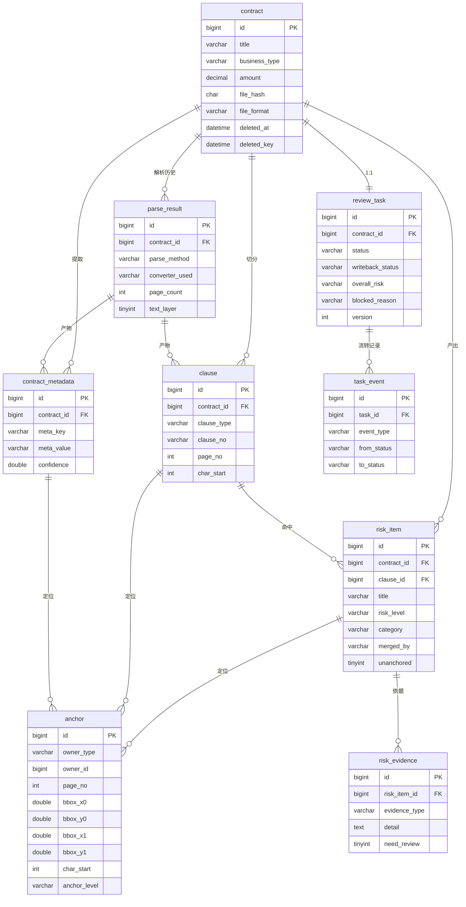
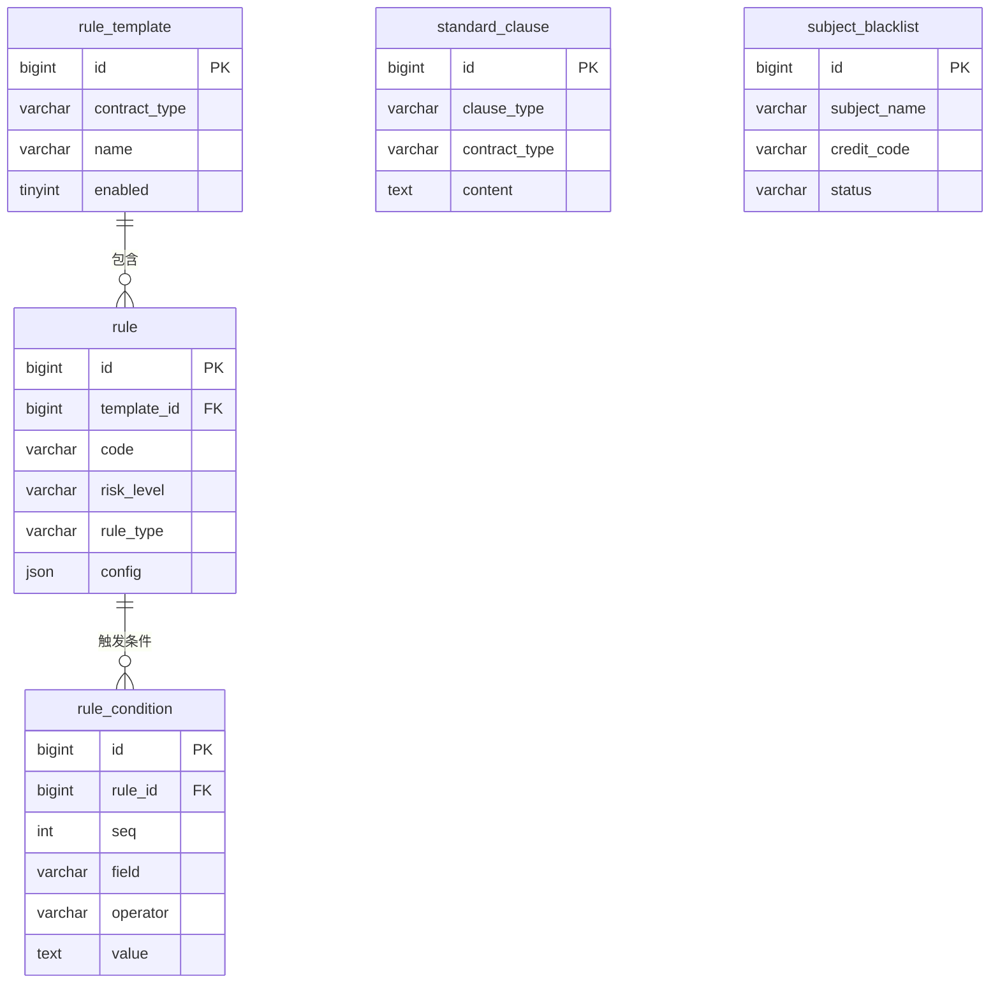
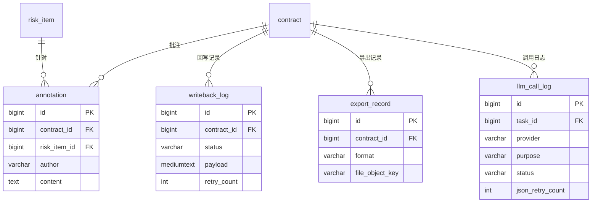
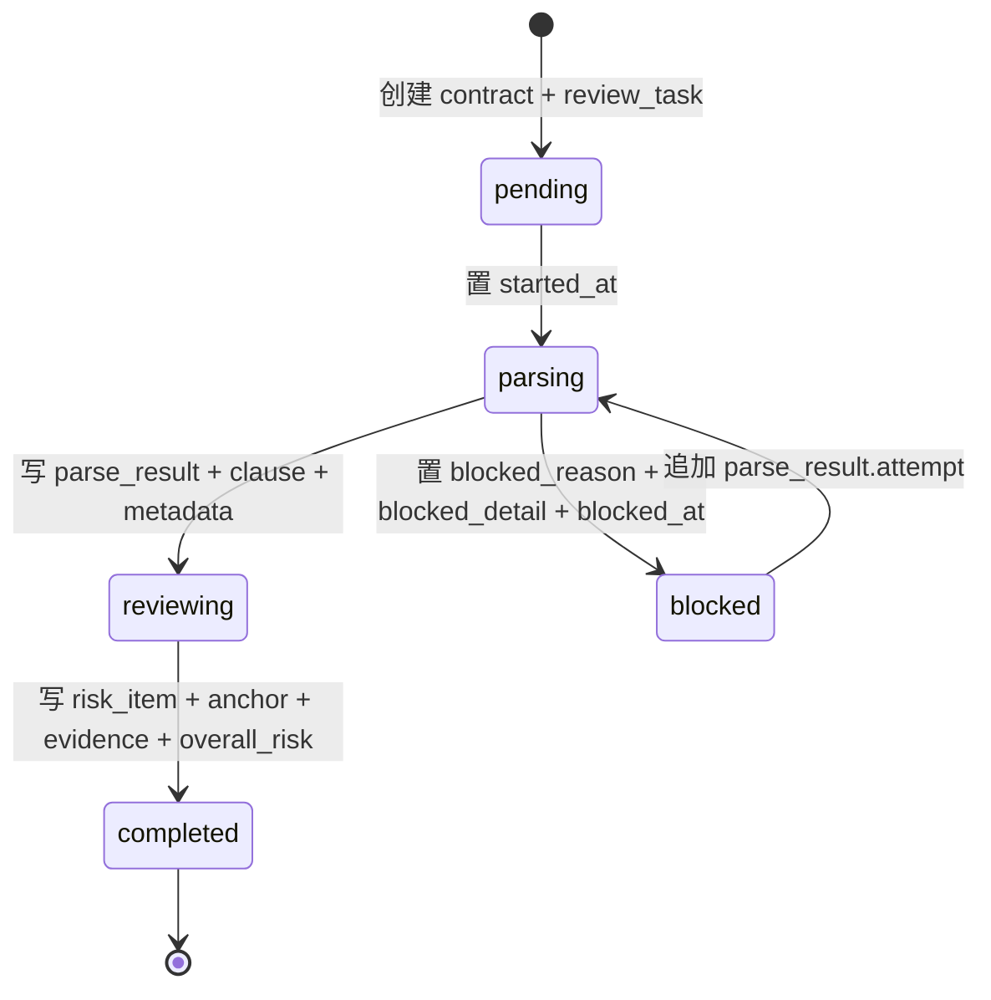
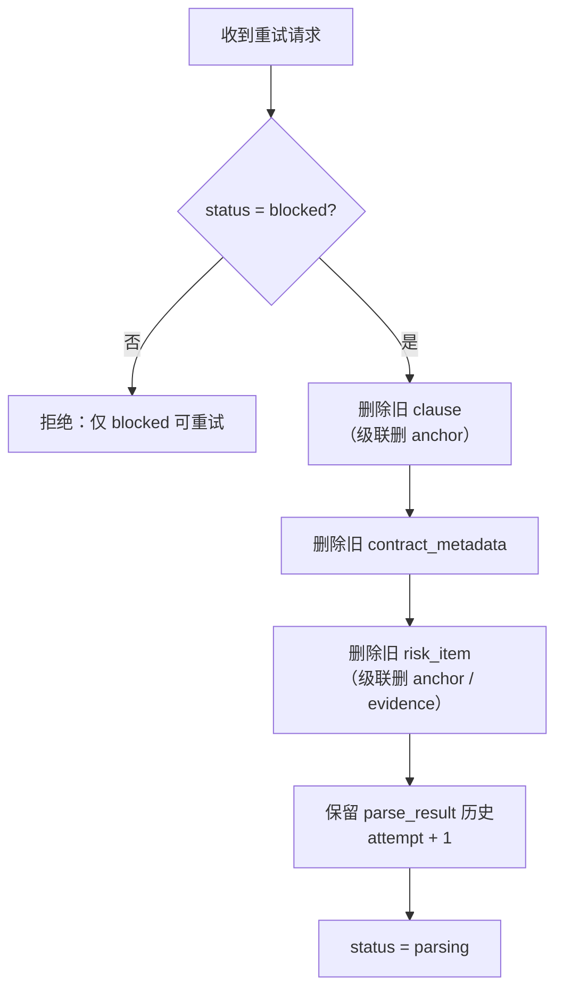
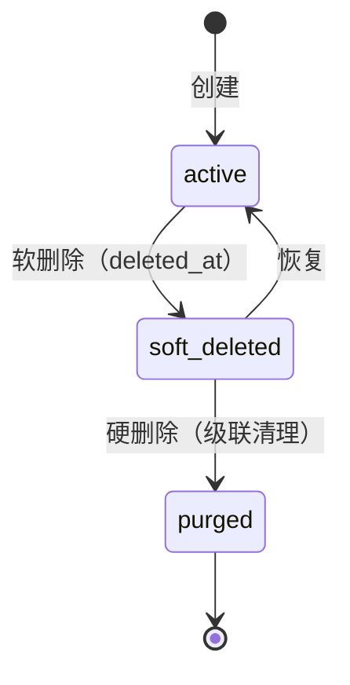
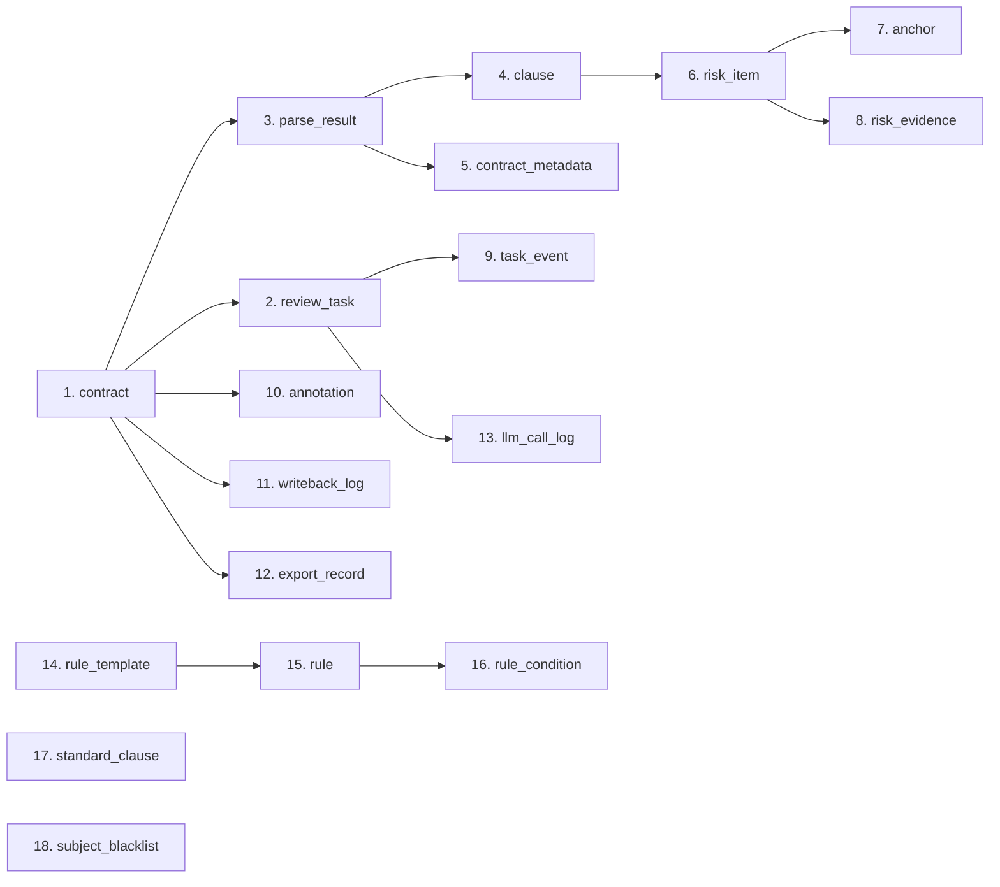

# 合同审批审查系统 — 数据对象设计文档

| 项 | 内容 |
|---|---|
| 文档版本 | v1.0 |
| 状态 | 已定稿，待评审 |
| 上游文档 | `docs/architecture.md`（架构设计） |
| 数据库 | MySQL 8.4 · utf8mb4 · utf8mb4_0900_ai_ci |
| 对象存储 | MinIO |
| 缓存 | Redis 8 |

> 本文档定义系统的**全部数据对象**：枚举字典、实体、值对象、索引、状态机、
> 存储映射、生命周期与不变量。是建表与编码的**唯一依据**。

---

## 1. 设计原则

| # | 原则 | 说明 |
|---|---|---|
| P1 | **锚点是一等公民** | 原文定位是本系统的核心能力，数据层必须显式支撑多片段引用 |
| P2 | **枚举用 VARCHAR 而非 MySQL ENUM** | MySQL ENUM 增删值需 DDL；用 `VARCHAR(16/32)` + 应用层枚举，扩展无需迁移 |
| P3 | **大文件不进库** | 合同原件、转换后 PDF、导出报告存 MinIO，库内只存 object key |
| P4 | **冗余计数为列表页服务** | `risk_count` / `high_risk_count` 等冗余字段避免列表页 N+1 聚合查询 |
| P5 | **审计信息不可省** | 状态流转、回写、LLM 调用、导出全部留痕，满足"可溯源"要求 |
| P6 | **软删除仅用于合同** | 其余实体随合同级联硬删；软删除与唯一约束的冲突面控制在单表内（解法见 §5.1） |
| P7 | **时间统一 DATETIME(3)** | 毫秒精度，时区统一 +08:00（由容器参数保证） |

### 1.1 命名约定

| 对象 | 约定 | 示例 |
|---|---|---|
| 表名 | 小写下划线，单数 | `contract`、`risk_item` |
| 主键 | `id`，`BIGINT UNSIGNED AUTO_INCREMENT` | — |
| 外键 | `{单数表名}_id` | `contract_id` |
| 布尔 | `is_` / `need_` / `has_` 前缀，`TINYINT(1)` | `is_global`、`need_review` |
| 时间 | `_at` 后缀 | `created_at`、`blocked_at` |
| 索引 | `idx_{表简称}_{列}`；唯一 `uk_`；外键 `fk_` | `idx_risk_level` |

---

## 2. 领域概念与术语

| 概念 | 定义 | 对应实体 |
|---|---|---|
| **合同（Contract）** | 一份待审或已审的合同文档及其业务属性 | `contract` |
| **审查任务（Review Task）** | 一次完整的解析+审查过程，承载状态机 | `review_task` |
| **解析结果（Parse Result）** | 一次解析的产物元信息（页数、方式、耗时） | `parse_result` |
| **条款（Clause）** | 从合同正文中切分出的结构化段落 | `clause` |
| **元数据项（Metadata）** | 从合同中提取的键值对（金额、主体、期限…） | `contract_metadata` |
| **锚点（Anchor）** | 指向原文位置的值对象：页码 + 坐标 + 可选字符区间 | `anchor` |
| **风险项（Risk Item）** | 审查产出的单条风险，含等级、成因、依据、建议 | `risk_item` |
| **风险依据（Evidence）** | 支撑风险判定的来源（规则命中 / LLM 研判 / 法条） | `risk_evidence` |
| **规则模板（Rule Template）** | 按合同类型组织的审查清单 | `rule_template` |
| **规则（Rule）** | 单条审查规则，含类型、等级、结果模板 | `rule` |
| **标准示范条款** | 可复用的推荐条款文本库 | `standard_clause` |

### 2.1 关键区分

> ⚠️ **`clause` 与 `anchor` 的区别**
> - `clause` 是**文档结构**：条款本身在原文中的位置是它的固有属性，随解析确定
> - `anchor` 是**分析引用**：风险项指向原文的引用，是审查产物的组成部分，且可多片段
>
> 因此条款的定位内嵌在 `clause` 表，风险项的定位走独立 `anchor` 表。

> ⚠️ **`risk_item.reason` 与 `risk_evidence.detail` 的区别**
> - `reason` 是**面向用户的结论**："违约责任严重不对等，我方承担无上限赔偿责任"
> - `evidence` 是**支撑结论的依据链**：命中了哪条规则、阈值是多少、LLM 的推理过程
>
> 报告里两者都要呈现：结论给业务方看，依据给法务看。

---

## 3. 枚举字典

> 所有枚举值在应用层以 Python `StrEnum` 定义，数据库存字符串。
> **新增枚举值不需要 DDL**，这是 P2 的直接收益。

### 3.1 任务与流程

| 枚举 | 值 | 中文 | 说明 |
|---|---|---|---|
| `TaskStatus` | `pending` | 待处理 | 任务已创建，未开始 |
| | `parsing` | 解析中 | 文档解析/OCR 进行中（CPU OCR 为分钟级） |
| | `reviewing` | 审查中 | 规则+LLM 审查进行中 |
| | `blocked` | 解析受阻 | 加密/空白/严重模糊/超时 |
| | `completed` | 审查完成 | 终态 |
| `WritebackStatus` | `not_written` | 未回写 | 初始态 |
| | `writing` | 回写中 | 已发起，未返回 |
| | `success` | 回写成功 | 终态 |
| | `failed` | 回写失败 | 可重试 |
| `BlockedReason` | `encrypted` | 文档已加密 | 无法解密 |
| | `empty_content` | 正文为空 | 提取不到文字 |
| | `blurred` | 扫描件严重模糊 | OCR 置信度过低 |
| | `timeout` | 处理超时 | 超过动态阈值 |
| | `converter_unavailable` | 转换器不可用 | WPS/LibreOffice 均失败 |
| | `error` | 其他异常 | 兜底 |
| `TaskEventType` | `status_change` | 状态流转 | — |
| | `retry` | 重试 | — |
| | `blocked` | 阻塞 | — |
| | `progress` | 进度上报 | — |

### 3.2 风险

| 枚举 | 值 | 中文 | 说明 |
|---|---|---|---|
| `RiskLevel` | `high` | 高风险 | 最高优先级 |
| | `medium` | 中风险 | — |
| | `low` | 低风险 | — |
| `RiskCategory` | `subject_qualification` | 主体资质 | — |
| | `amount_payment` | 金额支付 | — |
| | `liability` | 违约责任 | — |
| | `intellectual_property` | 知识产权 | — |
| | `jurisdiction` | 争议管辖 | — |
| | `confidentiality` | 保密义务 | — |
| | `data_security` | 数据安全 | — |
| | `acceptance` | 验收标准 | — |
| | `force_majeure` | 不可抗力 | — |
| | `other` | 其他 | — |
| `MergedBy` | `rule` | 仅规则命中 | — |
| | `llm` | 仅 LLM 研判 | — |
| | `both` | 两者均命中 | 报告呈现两条依据 |
| | `manual` | 人工添加 | — |
| `ReviewConclusion` | `pass` | 通过 | 无风险或仅低风险 |
| | `rectify` | 建议整改 | 存在中风险 |
| | `reject` | 建议拒绝 | 存在高风险 |

### 3.3 条款与解析

| 枚举 | 值 | 中文 |
|---|---|---|
| `ClauseType` | `subject_matter` | 标的物 |
| | `payment` | 付款进度 |
| | `acceptance` | 验收标准 |
| | `liability` | 违约责任 |
| | `confidentiality` | 保密义务 |
| | `data_security` | 数据安全 |
| | `jurisdiction` | 争议解决管辖 |
| | `intellectual_property` | 知识产权 |
| | `force_majeure` | 不可抗力 |
| | `other` | 其他 |
| `ParseMethod` | `docx_wps_com` | DOCX 经 WPS 转 PDF |
| | `docx_libreoffice` | DOCX 经 LibreOffice 转 PDF |
| | `docx_passthrough` | DOCX 无分页降级 |
| | `pdf_native` | 文本型 PDF 直接提取 |
| | `ocr_rapidocr` | 扫描件 OCR |
| `ParseStatus` | `success` | 全部成功 |
| | `partial` | 部分成功（部分页失败） |
| | `failed` | 失败 |
| `AnchorSource` | `native_text` | 原生文本层 |
| | `ocr` | OCR 识别 |
| `AnchorLevel` | `exact` | 精确匹配 |
| | `fuzzy` | 模糊匹配 |
| | `paragraph` | 降级到段落级 |
| | `none` | 无法锚定 |
| `FileFormat` | `docx` | Word 文档 |
| | `pdf` | 文本型 PDF |
| | `scanned_pdf` | 扫描件 PDF |
| | `image` | 图片 |

### 3.4 配置

| 枚举 | 值 | 说明 |
|---|---|---|
| `BusinessType` | `purchase` / `sales` / `service` / `labor` | 合同业务类型 |
| `RuleType` | `keyword` | 关键词匹配 |
| | `regex` | 正则匹配 |
| | `threshold` | 阈值比较 |
| | `presence` | 存在性检查（必备条款） |
| | `blacklist` | 黑名单匹配 |
| `RuleOperator` | `contains` / `not_contains` / `regex` / `gt` / `gte` / `lt` / `lte` / `eq` / `exists` / `not_exists` | 条件运算符 |
| `EvidenceType` | `rule` | 规则命中 |
| | `llm` | LLM 研判 |
| | `law` | 法律条文 |
| | `manual` | 人工添加 |
| `MetadataKey` | 见 §3.5 | 元数据键 |

### 3.5 元数据键（`MetadataKey`）

| key | 中文标签 | value_type | 必需 | 缺失时风险 |
|---|---|---|---|---|
| `party_a_name` | 甲方名称 | string | ✅ | 高风险（主体信息缺失） |
| `party_b_name` | 乙方名称 | string | ✅ | 高风险 |
| `party_a_credit_code` | 甲方统一社会信用代码 | string | ✅ | 中风险 |
| `party_b_credit_code` | 乙方统一社会信用代码 | string | ✅ | 中风险 |
| `contract_no` | 合同编号 | string | ❌ | — |
| `amount` | 合同金额 | decimal | ✅ | 中风险 |
| `currency` | 币种 | string | ✅ | 中风险 |
| `term` | 履行期限 | string | ❌ | 中风险 |
| `effective_condition` | 生效条件 | string | ❌ | 低风险 |
| `sign_date` | 签订日期 | date | ❌ | — |
| `sign_place` | 签订地点 | string | ❌ | — |

---

## 4. 实体关系总览

> 18 张表按域拆为三张图，避免单图超过可读密度。

### 4.1 核心域



### 4.2 配置域



### 4.3 协同与审计域



---

## 5. 实体详述

### 5.1 `contract` — 合同

**职责**：合同的业务属性与文件引用。是所有其他实体的聚合根。

| 字段 | 类型 | 空 | 默认 | 说明 |
|---|---|---|---|---|
| `id` | BIGINT UNSIGNED | ❌ | AUTO | 主键 |
| `title` | VARCHAR(255) | ❌ | — | 合同名称 |
| `contract_no` | VARCHAR(64) | ✅ | NULL | 合同编号（从文档提取，可能缺失） |
| `business_type` | VARCHAR(32) | ❌ | — | `BusinessType` |
| `amount` | DECIMAL(18,2) | ✅ | NULL | 合同金额（未提取到为 NULL） |
| `currency` | VARCHAR(8) | ✅ | `CNY` | 币种 |
| `applicant` | VARCHAR(64) | ✅ | NULL | 申请人 |
| `applicant_dept` | VARCHAR(128) | ✅ | NULL | 送审部门 |
| `counterparty_name` | VARCHAR(255) | ✅ | NULL | 相对方主体名称 |
| `counterparty_code` | VARCHAR(32) | ✅ | NULL | 相对方统一社会信用代码 |
| `file_format` | VARCHAR(16) | ❌ | — | `FileFormat` |
| `file_object_key` | VARCHAR(512) | ❌ | — | MinIO 中**原件**的 object key |
| `file_name` | VARCHAR(255) | ❌ | — | 原始文件名 |
| `file_size` | BIGINT UNSIGNED | ❌ | — | 字节数 |
| `file_hash` | CHAR(64) | ❌ | — | SHA-256 十六进制，用于去重 |
| `pdf_object_key` | VARCHAR(512) | ✅ | NULL | 转换后 PDF 的 object key（统一渲染用） |
| `source` | VARCHAR(16) | ❌ | `upload` | `upload` / `approval_sync` |
| `external_id` | VARCHAR(128) | ✅ | NULL | 审批系统中的单号 |
| `deleted_at` | DATETIME(3) | ✅ | NULL | 软删除标记；NULL = 活跃 |
| `deleted_key` | DATETIME(3) | — | 生成列 | `IFNULL(deleted_at, '1970-01-01 00:00:00.000')`，**仅参与唯一键，不可写入** |
| `created_at` | DATETIME(3) | ❌ | NOW(3) | — |
| `updated_at` | DATETIME(3) | ❌ | NOW(3) | ON UPDATE |

**索引**

| 名称 | 列 | 类型 | 用途 |
|---|---|---|---|
| `uk_file_hash` | `file_hash`, `deleted_key` | UNIQUE | 去重；用生成列而非 `deleted_at` 本身（见下方说明） |
| `idx_business_type` | `business_type` | 普通 | 按业务类型筛选 |
| `idx_created_at` | `created_at` | 普通 | 大盘页默认排序 |
| `idx_external_id` | `external_id` | 普通 | 审批系统单号反查 |

**不变量**

- `file_hash` 在未删除的合同中唯一（应用层先查后插，DB 唯一键兜底）
- `pdf_object_key` 在解析成功后必须非空；`blocked` 状态下可为空
- `amount` 为负数时拒绝写入（应用层校验）

> ⚠️ **为什么用生成列 `deleted_key` 而不是直接拿 `deleted_at` 进唯一键**
>
> **直觉上**「NULL 不参与唯一性判断，所以未删除行之间会正常判重」——**这个直觉是错的**。
> 实测（MySQL 8.4 与 SQLite 行为一致）：
>
> ```sql
> UNIQUE KEY uk(file_hash, deleted_at)   -- deleted_at 可为 NULL
> INSERT INTO contract(file_hash, deleted_at) VALUES('abc', NULL);  -- 成功
> INSERT INTO contract(file_hash, deleted_at) VALUES('abc', NULL);  -- 也成功！行数 = 2
> ```
>
> SQL 标准中 **NULL 表示"不确定"，任何值都不与它冲突，包括另一个 NULL**。
> 因此若直接让可空的 `deleted_at` 进唯一键，去重会**完全失效**——同一份文件可被
> 重复插入任意多次。
>
> **正确做法**：用一个 `NOT NULL` 的生成列把 NULL 归一化为哨兵值，
> 让唯一键作用在生成列上：
>
> ```sql
> deleted_at  DATETIME(3) NULL,
> deleted_key DATETIME(3) GENERATED ALWAYS AS (IFNULL(deleted_at, '1970-01-01 00:00:00.000')) STORED,
> UNIQUE KEY uk_file_hash(file_hash, deleted_key)
> ```
>
> **实测验证**（MySQL 8.4）：
>
> | 场景 | 结果 |
> |---|---|
> | 首次插入 `(abc, NULL)` | ✅ 成功，`deleted_key` = 哨兵值 |
> | 重复插入 `(abc, NULL)` | ✅ 被拒 `ERROR 1062 Duplicate entry 'abc-1970-01-01...'` |
> | 软删除后重传同名文件 | ✅ 成功（`deleted_at` 有值，`deleted_key` 不同） |
> | 恢复软删除行（与活跃行冲突） | ✅ 被拒 `ERROR 1062` |
> | 应用层误写 `deleted_key` | ✅ 被拒 `ERROR 3105`（生成列不可写） |
>
> **收益**：`deleted_at` 保持 `NULL` 语义干净（查询里写 `deleted_at IS NULL` 即可，
> 不必到处比对哨兵值），唯一性由数据库强制保证。
>
> **数据库兼容性**（若将来迁 SQLite，写法需调整）：
>
> | 数据库 | 生成列写法 |
> |---|---|
> | MySQL 8.4 | `GENERATED ALWAYS AS (IFNULL(deleted_at, '1970-01-01 00:00:00.000')) STORED` |
> | SQLite 3.31+ | `GENERATED ALWAYS AS (COALESCE(deleted_at, '1970-01-01 00:00:00.000')) STORED` |
>
> 注意：SQLite 不支持 `DATETIME` 类型，需改用 `TEXT`。
> 这也印证了 §附录B 的选型结论——**本项目选用 MySQL，正是为了避开这类类型系统差异**。

---

### 5.2 `review_task` — 审查任务

**职责**：承载状态机，是并发控制的锚点。

| 字段 | 类型 | 空 | 默认 | 说明 |
|---|---|---|---|---|
| `id` | BIGINT UNSIGNED | ❌ | AUTO | 主键 |
| `contract_id` | BIGINT UNSIGNED | ❌ | — | FK → `contract.id` |
| `status` | VARCHAR(16) | ❌ | `pending` | `TaskStatus` |
| `writeback_status` | VARCHAR(16) | ❌ | `not_written` | `WritebackStatus` |
| `blocked_reason` | VARCHAR(32) | ✅ | NULL | `BlockedReason`，仅 `blocked` 时非空 |
| `blocked_detail` | VARCHAR(512) | ✅ | NULL | 阻塞详情（如具体哪一页失败） |
| `overall_risk` | VARCHAR(8) | ✅ | NULL | `RiskLevel`，审查完成后写入 |
| `conclusion` | VARCHAR(16) | ✅ | NULL | `ReviewConclusion` |
| `summary` | TEXT | ✅ | NULL | 综合风险摘要 |
| `total_pages` | INT | ✅ | NULL | 解析后确定 |
| `parsed_pages` | INT | ❌ | 0 | 已解析页数（进度上报） |
| `high_risk_count` | INT | ❌ | 0 | 冗余计数，列表页用 |
| `medium_risk_count` | INT | ❌ | 0 | 同上 |
| `low_risk_count` | INT | ❌ | 0 | 同上 |
| `parse_duration_ms` | INT UNSIGNED | ✅ | NULL | 解析耗时 |
| `review_duration_ms` | INT UNSIGNED | ✅ | NULL | 审查耗时 |
| `started_at` | DATETIME(3) | ✅ | NULL | 进入 `parsing` 的时刻 |
| `blocked_at` | DATETIME(3) | ✅ | NULL | 进入 `blocked` 的时刻 |
| `completed_at` | DATETIME(3) | ✅ | NULL | 进入 `completed` 的时刻 |
| `version` | INT UNSIGNED | ❌ | 0 | **乐观锁**，防并发重复执行 |
| `created_at` | DATETIME(3) | ❌ | NOW(3) | — |
| `updated_at` | DATETIME(3) | ❌ | NOW(3) | ON UPDATE |

**索引**

| 名称 | 列 | 用途 |
|---|---|---|
| `uk_contract_id` | `contract_id` UNIQUE | 一个合同对应一个任务（1:1） |
| `idx_status` | `status` | 按状态筛选 |
| `idx_status_created` | `status`, `created_at` | 大盘页"待处理"列表 |
| `idx_overall_risk` | `overall_risk` | 按风险筛选 |

**不变量**

| # | 不变量 | 违反后果 |
|---|---|---|
| I1 | `status = 'blocked'` ⟺ `blocked_reason` 非空 | 无法展示阻塞原因 |
| I2 | `status = 'completed'` ⟹ `overall_risk` 与 `conclusion` 非空 | 报告不完整 |
| I3 | `parsed_pages ≤ total_pages`（`total_pages` 非空时） | 进度显示超过 100% |
| I4 | `writeback_status` 仅在 `status = 'completed'` 后可流转 | 未审完就回写 |
| I5 | 冗余计数之和 = `risk_item` 中该合同的实际条数 | 列表页数据不一致 |

> ⚠️ **I5 的一致性维护**：冗余计数在审查完成时一次性写入，并提供
> `scripts/check_consistency.py` 定期校验。不做触发器——触发器会隐藏逻辑，
> 且与 ORM 层的行为容易冲突。

---

### 5.3 `parse_result` — 解析结果

**职责**：一次解析的产物元信息。保留历史以支持"重新解析后对比"。

| 字段 | 类型 | 空 | 默认 | 说明 |
|---|---|---|---|---|
| `id` | BIGINT UNSIGNED | ❌ | AUTO | 主键 |
| `contract_id` | BIGINT UNSIGNED | ❌ | — | FK → `contract.id` |
| `task_id` | BIGINT UNSIGNED | ❌ | — | FK → `review_task.id` |
| `parse_method` | VARCHAR(32) | ❌ | — | `ParseMethod` |
| `converter_used` | VARCHAR(32) | ✅ | NULL | 实际生效的 DOCX 转换器 |
| `converter_fallback_chain` | VARCHAR(255) | ✅ | NULL | 降级链，如 `wps_com>libreoffice>passthrough` |
| `ocr_engine` | VARCHAR(32) | ✅ | NULL | OCR 引擎名（扫描件才有） |
| `ocr_dpi` | INT | ✅ | NULL | 渲染 DPI |
| `page_count` | INT | ❌ | — | 总页数 |
| `failed_pages` | VARCHAR(512) | ✅ | NULL | 失败页号，逗号分隔，如 `3,7` |
| `has_text_layer` | TINYINT(1) | ❌ | 0 | 是否有原生文本层 |
| `status` | VARCHAR(16) | ❌ | — | `ParseStatus` |
| `avg_confidence` | DOUBLE | ✅ | NULL | OCR 平均置信度 |
| `duration_ms` | INT UNSIGNED | ❌ | — | 解析耗时 |
| `attempt` | INT UNSIGNED | ❌ | 1 | 第几次尝试（重试递增） |
| `error_detail` | TEXT | ✅ | NULL | 失败详情 |
| `created_at` | DATETIME(3) | ❌ | NOW(3) | — |

**索引**

| 名称 | 列 | 用途 |
|---|---|---|
| `idx_contract_attempt` | `contract_id`, `attempt` DESC | 取最新一次解析 |
| `idx_task_id` | `task_id` | 按任务查 |

**不变量**

- `has_text_layer = 1` ⟹ `parse_method ∈ {pdf_native, docx_wps_com, docx_libreoffice}`
- `parse_method = 'ocr_rapidocr'` ⟹ `ocr_engine` 与 `ocr_dpi` 非空
- `failed_pages` 非空 ⟹ `status = 'partial'`

> ⚠️ **`converter_fallback_chain` 为什么要存**：架构文档 §5.4 定义了三级降级。
> 若 WPS 不可用降级到 LibreOffice，**页码语义就变了**（实测 2 页 vs 3 页）。
> 必须留痕，否则报告里的页码无法解释。

---

### 5.4 `clause` — 条款

**职责**：合同正文的结构化切分结果。**自带位置**（是文档结构，非分析引用）。

| 字段 | 类型 | 空 | 默认 | 说明 |
|---|---|---|---|---|
| `id` | BIGINT UNSIGNED | ❌ | AUTO | 主键 |
| `contract_id` | BIGINT UNSIGNED | ❌ | — | FK → `contract.id` |
| `parse_result_id` | BIGINT UNSIGNED | ❌ | — | FK → `parse_result.id`，标明产物来源 |
| `clause_type` | VARCHAR(32) | ❌ | — | `ClauseType` |
| `clause_no` | VARCHAR(32) | ✅ | NULL | 条款序号，如 `第三条` / `3.2` |
| `title` | VARCHAR(255) | ✅ | NULL | 条款标题 |
| `content` | MEDIUMTEXT | ❌ | — | 条款正文 |
| `page_no` | INT | ❌ | — | 起始页码，从 1 开始 |
| `page_end` | INT | ✅ | NULL | 结束页码（跨页条款） |
| `para_index` | INT | ❌ | — | 段落索引，从 0 开始 |
| `char_start` | INT UNSIGNED | ✅ | NULL | 在**全文**中的字符起始偏移；扫描件为 NULL |
| `char_end` | INT UNSIGNED | ✅ | NULL | 字符结束偏移（不含） |
| `bbox_x0` | DOUBLE | ✅ | NULL | 起始页坐标（PDF point） |
| `bbox_y0` | DOUBLE | ✅ | NULL | — |
| `bbox_x1` | DOUBLE | ✅ | NULL | — |
| `bbox_y1` | DOUBLE | ✅ | NULL | — |
| `seq` | INT | ❌ | — | 在文档中的顺序 |
| `source` | VARCHAR(16) | ❌ | — | `AnchorSource` |
| `created_at` | DATETIME(3) | ❌ | NOW(3) | — |

**索引**

| 名称 | 列 | 用途 |
|---|---|---|
| `idx_contract_seq` | `contract_id`, `seq` | 按文档顺序读取 |
| `idx_contract_type` | `contract_id`, `clause_type` | 按类型查条款（规则引擎用） |
| `idx_parse_result` | `parse_result_id` | 重解析时清理旧产物 |

**不变量**

- `char_start < char_end`（两者均非空时）
- `source = 'native_text'` ⟹ `char_start` / `char_end` 非空
- `source = 'ocr'` ⟹ `bbox_*` 非空，`char_*` 可为空

> ⚠️ **`content` 为什么用 MEDIUMTEXT 而非存全文**：单条款通常 < 64KB，
> MEDIUMTEXT 上限 16MB 足够。**全文不单独存**——按 `seq` 顺序拼接所有
> `clause.content` 即可重建，避免同一份文本存两份。

---

### 5.5 `contract_metadata` — 合同元数据

**职责**：从合同中提取的键值对，是**报告"合同基本信息"的数据源**。

| 字段 | 类型 | 空 | 默认 | 说明 |
|---|---|---|---|---|
| `id` | BIGINT UNSIGNED | ❌ | AUTO | 主键 |
| `contract_id` | BIGINT UNSIGNED | ❌ | — | FK → `contract.id` |
| `parse_result_id` | BIGINT UNSIGNED | ❌ | — | FK → `parse_result.id` |
| `meta_key` | VARCHAR(64) | ❌ | — | `MetadataKey` |
| `meta_value` | VARCHAR(1024) | ✅ | NULL | 原始值（字符串形式） |
| `value_normalized` | VARCHAR(512) | ✅ | NULL | 归一化值（金额→数字串、日期→ISO） |
| `value_type` | VARCHAR(16) | ❌ | — | `string` / `decimal` / `date` |
| `confidence` | DOUBLE | ❌ | 1.0 | 提取置信度（OCR 来源 < 1.0） |
| `need_review` | TINYINT(1) | ❌ | 0 | 是否需人工核对（OCR 低置信时置 1） |
| `created_at` | DATETIME(3) | ❌ | NOW(3) | — |

**索引**

| 名称 | 列 | 类型 | 用途 |
|---|---|---|---|
| `uk_contract_key` | `contract_id`, `meta_key` | UNIQUE | 同一合同同键只保留一条 |
| `idx_need_review` | `contract_id`, `need_review` | 普通 | UI 高亮待核对项 |

**不变量**

- `meta_key = 'amount'` ⟹ `value_type = 'decimal'` 且 `value_normalized` 可转为 `Decimal`
- `need_review = 1` ⟹ `confidence < 阈值`（默认 0.9）

> ⚠️ **元数据的锚点走 `anchor` 表**（`owner_type='contract_metadata'`），
> 因为元数据值的位置是"分析定位"的结果，且一个值可能由多处拼接（如金额出现在
> 正文和表格两处）。

---

### 5.6 `risk_item` — 风险项

**职责**：审查的核心产出。**报告"风险清单明细"的数据源**。

| 字段 | 类型 | 空 | 默认 | 说明 |
|---|---|---|---|---|
| `id` | BIGINT UNSIGNED | ❌ | AUTO | 主键 |
| `contract_id` | BIGINT UNSIGNED | ❌ | — | FK → `contract.id` |
| `clause_id` | BIGINT UNSIGNED | ✅ | NULL | FK → `clause.id`；全局性问题（必备条款缺失）为 NULL |
| `title` | VARCHAR(255) | ❌ | — | 风险项名称 |
| `risk_level` | VARCHAR(8) | ❌ | — | `RiskLevel` |
| `category` | VARCHAR(32) | ❌ | — | `RiskCategory` |
| `reason` | TEXT | ❌ | — | 风险成因分析（面向用户） |
| `legal_basis` | TEXT | ✅ | NULL | 法律合规依据 |
| `suggestion` | TEXT | ✅ | NULL | AI 生成的推荐修改条款 |
| `suggestion_edited` | TEXT | ✅ | NULL | 法务编辑后的版本（非空时优先展示） |
| `adopted` | TINYINT(1) | ❌ | 0 | 法务是否采纳建议 |
| `merged_by` | VARCHAR(8) | ❌ | — | `MergedBy`，标明定级来源 |
| `is_global` | TINYINT(1) | ❌ | 0 | 是否全局性问题（非条款级） |
| `unanchored` | TINYINT(1) | ❌ | 0 | 引用无法定位（防幻觉闸门标记） |
| `seq` | INT | ❌ | — | 展示顺序（按等级+页码排序后固化） |
| `created_at` | DATETIME(3) | ❌ | NOW(3) | — |
| `updated_at` | DATETIME(3) | ❌ | NOW(3) | ON UPDATE |

**索引**

| 名称 | 列 | 用途 |
|---|---|---|
| `idx_contract_level` | `contract_id`, `risk_level` | 按等级分组展示 |
| `idx_contract_seq` | `contract_id`, `seq` | 有序读取 |
| `idx_clause_id` | `clause_id` | 按条款反查风险 |
| `idx_unanchored` | `unanchored` | 统计无法定位项 |

**不变量**

| # | 不变量 | 说明 |
|---|---|---|
| I1 | `is_global = 1` ⟹ `clause_id IS NULL` | 全局问题不属于任何条款 |
| I2 | `unanchored = 0` ⟹ 存在至少一条 `anchor` | 可定位项必须有锚点 |
| I3 | `merged_by = 'both'` ⟹ 同时存在 `evidence_type='rule'` 和 `'llm'` 的依据 | 双来源留痕 |
| I4 | `suggestion_edited` 非空 ⟹ `adopted = 1` | 编辑即视为采纳 |

> ⚠️ **I2 是防幻觉闸门的数据层体现**。架构文档 §8.7 规定"引用无法锚定的
> 风险项必须标记"。这里落地为：无法锚定 ⟹ `unanchored = 1`，
> 且**不写 anchor 行**。UI 对这类项显示"无法定位原文"，而非静默忽略。

> ⚠️ **`merged_by` 记录定级来源**，配合 `risk_evidence` 表实现
> 架构文档 §8.3 的"取高不取低 + 双来源留痕"。

---

### 5.7 `anchor` — 锚点（核心设计）

**职责**：统一的位置引用。**多态关联**，服务于"原文与风险卡片双向高亮"。

| 字段 | 类型 | 空 | 默认 | 说明 |
|---|---|---|---|---|
| `id` | BIGINT UNSIGNED | ❌ | AUTO | 主键 |
| `owner_type` | VARCHAR(32) | ❌ | — | `risk_item` / `contract_metadata` |
| `owner_id` | BIGINT UNSIGNED | ❌ | — | 多态外键 |
| `seq` | INT | ❌ | 0 | 同一 owner 内多片段的顺序 |
| `page_no` | INT | ❌ | — | 页码，从 1 开始 |
| `bbox_x0` | DOUBLE | ❌ | — | 左上 X（**PDF point 坐标**） |
| `bbox_y0` | DOUBLE | ❌ | — | 左上 Y |
| `bbox_x1` | DOUBLE | ❌ | — | 右下 X |
| `bbox_y1` | DOUBLE | ❌ | — | 右下 Y |
| `char_start` | INT UNSIGNED | ✅ | NULL | 全文中的字符起始；扫描件为 NULL |
| `char_end` | INT UNSIGNED | ✅ | NULL | 字符结束（不含） |
| `quote_text` | VARCHAR(512) | ✅ | NULL | 命中的原文片段（用于校验与展示） |
| `source` | VARCHAR(16) | ❌ | — | `AnchorSource` |
| `anchor_level` | VARCHAR(16) | ❌ | — | `AnchorLevel`（exact/fuzzy/paragraph/none） |
| `confidence` | DOUBLE | ✅ | NULL | OCR 置信度 |
| `created_at` | DATETIME(3) | ❌ | NOW(3) | — |

**索引**

| 名称 | 列 | 用途 |
|---|---|---|
| `idx_owner` | `owner_type`, `owner_id`, `seq` | **主查询路径**：按 owner 取全部锚点 |
| `idx_page` | `page_no` | 按页统计高亮密度 |

**不变量**

- `bbox_x0 < bbox_x1` 且 `bbox_y0 < bbox_y1`
- `bbox_*` 均在 `[0, page_width/height]` 范围内（应用层校验）
- `source = 'native_text'` ⟹ `char_start` / `char_end` 非空
- `anchor_level = 'paragraph'` ⟹ `char_start` / `char_end` 为 NULL（段落级无精确字符区间）
- `anchor_level = 'none'` 的行**不应存在**（无法锚定时不写行，改用 `risk_item.unanchored`）

> ⚠️ **为什么用多态而非每个 owner 建独立表**
> - 统一锚点模型是架构核心（架构文档 §6），坐标映射逻辑必须**只有一处实现**
> - 一个风险项可对应**多个**原文片段（如"违约责任不对等"横跨第 5、8 条）
> - 若拆表，前端需要三套取锚点逻辑，坐标校验也要写三遍
>
> **代价与弥补**：多态关联**无数据库级外键**，`owner_id` 悬空风险靠：
> ① 应用层只通过 ORM 关系写入；② `scripts/check_consistency.py` 定期扫描孤儿锚点。

> ⚠️ **`anchor_level` 的四级语义**（对应架构文档 §6.4 的三级降级）
> | 值 | 含义 | 前端表现 |
> |---|---|---|
> | `exact` | `search_for` 精确命中 | 精确高亮 |
> | `fuzzy` | 归一化后模糊命中 | 精确高亮 + 提示"近似匹配" |
> | `paragraph` | 降级到段落级 | 整段高亮 |
> | `none` | 无法定位 | **不写行**，改标 `unanchored=1` |

---

### 5.8 `risk_evidence` — 风险依据

**职责**：支撑风险判定的依据链。实现"双来源留痕"与"防幻觉"。

| 字段 | 类型 | 空 | 默认 | 说明 |
|---|---|---|---|---|
| `id` | BIGINT UNSIGNED | ❌ | AUTO | 主键 |
| `risk_item_id` | BIGINT UNSIGNED | ❌ | — | FK → `risk_item.id` |
| `evidence_type` | VARCHAR(16) | ❌ | — | `EvidenceType` |
| `rule_id` | BIGINT UNSIGNED | ✅ | NULL | `evidence_type='rule'` 时的来源规则 |
| `title` | VARCHAR(255) | ✅ | NULL | 依据标题，如"《民法典》第五百八十五条" |
| `detail` | TEXT | ❌ | — | 依据详情（命中条件 / 推理过程 / 条文原文） |
| `raw_snippet` | TEXT | ✅ | NULL | LLM 原始输出片段（审计用） |
| `need_review` | TINYINT(1) | ❌ | 0 | 依据待人工复核（LLM 编造法条时置 1） |
| `created_at` | DATETIME(3) | ❌ | NOW(3) | — |

**索引**

| 名称 | 列 | 用途 |
|---|---|---|
| `idx_risk_item` | `risk_item_id`, `evidence_type` | 按风险项取依据 |

**不变量**

- `evidence_type = 'rule'` ⟹ `rule_id` 非空
- `evidence_type = 'llm'` ⟹ `raw_snippet` 非空（保留原始输出以便审计）

> ⚠️ **`need_review` 的触发条件**：架构文档 §8.7 规定"法律依据要么限定在
> 知识库内选取，要么明确标注待人工复核"。落地为：LLM 输出的法条无法在
> `standard_clause` / 内置法条库中匹配时，`need_review = 1`。

---

### 5.9 `task_event` — 任务事件

**职责**：状态流转审计。回答"这个任务为什么变成了 blocked"。

| 字段 | 类型 | 空 | 默认 | 说明 |
|---|---|---|---|---|
| `id` | BIGINT UNSIGNED | ❌ | AUTO | 主键 |
| `task_id` | BIGINT UNSIGNED | ❌ | — | FK → `review_task.id` |
| `event_type` | VARCHAR(32) | ❌ | — | `TaskEventType` |
| `from_status` | VARCHAR(16) | ✅ | NULL | 变更前状态 |
| `to_status` | VARCHAR(16) | ✅ | NULL | 变更后状态 |
| `operator` | VARCHAR(64) | ✅ | NULL | 操作人；系统操作为 `system` |
| `detail` | VARCHAR(1024) | ✅ | NULL | 事件详情 |
| `created_at` | DATETIME(3) | ❌ | NOW(3) | — |

**索引**

| 名称 | 列 | 用途 |
|---|---|---|
| `idx_task_created` | `task_id`, `created_at` | 按时间线读取 |

**不变量**：`event_type = 'status_change'` ⟹ `from_status` 与 `to_status` 均非空且不相等

---

### 5.10 `annotation` — 法务批注

**职责**：法务的人工意见，回写内容的一部分。

| 字段 | 类型 | 空 | 默认 | 说明 |
|---|---|---|---|---|
| `id` | BIGINT UNSIGNED | ❌ | AUTO | 主键 |
| `contract_id` | BIGINT UNSIGNED | ❌ | — | FK → `contract.id` |
| `risk_item_id` | BIGINT UNSIGNED | ✅ | NULL | 针对特定风险项的批注；整体意见为 NULL |
| `author` | VARCHAR(64) | ❌ | — | 批注人 |
| `author_role` | VARCHAR(32) | ✅ | NULL | 角色，如 `法务审查人` |
| `content` | TEXT | ❌ | — | 批注内容 |
| `created_at` | DATETIME(3) | ❌ | NOW(3) | — |
| `updated_at` | DATETIME(3) | ❌ | NOW(3) | ON UPDATE |

**索引**

| 名称 | 列 | 用途 |
|---|---|---|
| `idx_contract_created` | `contract_id`, `created_at` | 按时间读取批注 |
| `idx_risk_item` | `risk_item_id` | 取某风险项的批注 |

---

### 5.11 `writeback_log` — 回写记录

**职责**：回写审计与幂等保障。

| 字段 | 类型 | 空 | 默认 | 说明 |
|---|---|---|---|---|
| `id` | BIGINT UNSIGNED | ❌ | AUTO | 主键 |
| `contract_id` | BIGINT UNSIGNED | ❌ | — | FK → `contract.id` |
| `status` | VARCHAR(16) | ❌ | — | `WritebackStatus` |
| `payload` | MEDIUMTEXT | ❌ | — | 发送的 Markdown 文本 |
| `response` | TEXT | ✅ | NULL | 审批系统返回原文 |
| `http_status` | INT | ✅ | NULL | HTTP 状态码 |
| `retry_count` | INT UNSIGNED | ❌ | 0 | 重试次数 |
| `error_detail` | TEXT | ✅ | NULL | 失败详情 |
| `duration_ms` | INT UNSIGNED | ✅ | NULL | 耗时 |
| `created_at` | DATETIME(3) | ❌ | NOW(3) | — |

**索引**

| 名称 | 列 | 用途 |
|---|---|---|
| `idx_contract_created` | `contract_id`, `created_at` DESC | 取最近一次回写 |
| `idx_status` | `status` | 查失败的待重试 |

**不变量**

- 同一合同**至多一条** `status = 'success'` 的记录（应用层保证幂等）
- `status = 'failed'` ⟹ `error_detail` 非空

> ⚠️ **幂等实现**：回写前先查是否存在 `status='success'` 的记录。
> 若存在则直接返回成功，不重复调用审批系统。这比依赖审批系统的幂等键更可靠
> （mock 服务没有幂等键）。

---

### 5.12 `export_record` — 导出记录

| 字段 | 类型 | 空 | 默认 | 说明 |
|---|---|---|---|---|
| `id` | BIGINT UNSIGNED | ❌ | AUTO | 主键 |
| `contract_id` | BIGINT UNSIGNED | ❌ | — | FK → `contract.id` |
| `format` | VARCHAR(16) | ❌ | — | `markdown` / `pdf` |
| `file_object_key` | VARCHAR(512) | ❌ | — | MinIO object key |
| `file_size` | BIGINT UNSIGNED | ✅ | NULL | 字节数 |
| `created_by` | VARCHAR(64) | ✅ | NULL | 导出人 |
| `created_at` | DATETIME(3) | ❌ | NOW(3) | — |

**索引**：`idx_contract_created` (`contract_id`, `created_at` DESC)

---

### 5.13 `llm_call_log` — LLM 调用日志

**职责**：审计与成本观测。**不在循环体内写日志**，仅在每次调用后落一条。

| 字段 | 类型 | 空 | 默认 | 说明 |
|---|---|---|---|---|
| `id` | BIGINT UNSIGNED | ❌ | AUTO | 主键 |
| `task_id` | BIGINT UNSIGNED | ✅ | NULL | FK → `review_task.id` |
| `provider` | VARCHAR(32) | ❌ | — | `mock` / `openai_compat` |
| `model` | VARCHAR(64) | ✅ | NULL | 模型名 |
| `purpose` | VARCHAR(32) | ❌ | — | `clause_review` / `suggestion` / `summary` |
| `status` | VARCHAR(16) | ❌ | — | `success` / `failed` / `invalid_json` |
| `prompt_tokens` | INT | ✅ | NULL | — |
| `completion_tokens` | INT | ✅ | NULL | — |
| `json_retry_count` | INT UNSIGNED | ❌ | 0 | JSON 解析重试次数 |
| `duration_ms` | INT UNSIGNED | ✅ | NULL | — |
| `error_detail` | TEXT | ✅ | NULL | — |
| `created_at` | DATETIME(3) | ❌ | NOW(3) | — |

**索引**：`idx_task_id` (`task_id`)、`idx_status` (`status`)

> ⚠️ **`status = 'invalid_json'` 单独成值**：架构文档 §9.4 定义了 JSON 三层兜底。
> 把它单独记为一种状态，才能度量"提示词约束是否有效"。

---

### 5.14 `rule_template` — 规则模板

| 字段 | 类型 | 空 | 默认 | 说明 |
|---|---|---|---|---|
| `id` | BIGINT UNSIGNED | ❌ | AUTO | 主键 |
| `contract_type` | VARCHAR(32) | ❌ | — | `BusinessType` |
| `name` | VARCHAR(128) | ❌ | — | 模板名称 |
| `description` | VARCHAR(512) | ✅ | NULL | 描述 |
| `enabled` | TINYINT(1) | ❌ | 1 | 是否启用 |
| `created_at` | DATETIME(3) | ❌ | NOW(3) | — |
| `updated_at` | DATETIME(3) | ❌ | NOW(3) | ON UPDATE |

**索引**：`uk_contract_type` (`contract_type`) UNIQUE — 每种合同类型一个模板

---

### 5.15 `rule` — 审查规则

| 字段 | 类型 | 空 | 默认 | 说明 |
|---|---|---|---|---|
| `id` | BIGINT UNSIGNED | ❌ | AUTO | 主键 |
| `template_id` | BIGINT UNSIGNED | ❌ | — | FK → `rule_template.id` |
| `code` | VARCHAR(64) | ❌ | — | 规则编码，如 `LIABILITY_UNEQUAL` |
| `name` | VARCHAR(128) | ❌ | — | 规则名称 |
| `category` | VARCHAR(32) | ❌ | — | `RiskCategory` |
| `risk_level` | VARCHAR(8) | ❌ | — | `RiskLevel` |
| `rule_type` | VARCHAR(16) | ❌ | — | `RuleType` |
| `config` | JSON | ✅ | NULL | 类型相关参数（如 `{"threshold": 0.20}`） |
| `result_template` | TEXT | ✅ | NULL | 命中后的结论模板，支持 `{占位符}` |
| `suggestion_template` | TEXT | ✅ | NULL | 推荐修改条款模板 |
| `enabled` | TINYINT(1) | ❌ | 1 | 是否启用 |
| `seq` | INT | ❌ | 0 | 执行顺序 |
| `created_at` | DATETIME(3) | ❌ | NOW(3) | — |
| `updated_at` | DATETIME(3) | ❌ | NOW(3) | ON UPDATE |

**索引**：`uk_template_code` (`template_id`, `code`) UNIQUE、`idx_enabled` (`enabled`)

---

### 5.16 `rule_condition` — 规则触发条件

> 一条规则可有多个条件，**条件间为 AND**（OR 通过多条规则表达，保持语义简单）。

| 字段 | 类型 | 空 | 默认 | 说明 |
|---|---|---|---|---|
| `id` | BIGINT UNSIGNED | ❌ | AUTO | 主键 |
| `rule_id` | BIGINT UNSIGNED | ❌ | — | FK → `rule.id` |
| `seq` | INT | ❌ | 0 | 条件顺序 |
| `field` | VARCHAR(64) | ❌ | — | 作用字段，如 `clause.content` / `metadata.amount` |
| `operator` | VARCHAR(16) | ❌ | — | `RuleOperator` |
| `value` | TEXT | ✅ | NULL | 比较值；`exists` / `not_exists` 时为空 |
| `value_type` | VARCHAR(16) | ❌ | `string` | `string` / `decimal` / `regex` / `list` |

**索引**：`idx_rule_seq` (`rule_id`, `seq`)

**不变量**：`operator ∈ {exists, not_exists}` ⟹ `value` 为 NULL

---

### 5.17 `standard_clause` — 标准示范条款库

**职责**：条款推荐引擎的知识来源。**同时是防幻觉的"法条白名单"**。

| 字段 | 类型 | 空 | 默认 | 说明 |
|---|---|---|---|---|
| `id` | BIGINT UNSIGNED | ❌ | AUTO | 主键 |
| `clause_type` | VARCHAR(32) | ❌ | — | `ClauseType` |
| `contract_type` | VARCHAR(32) | ✅ | NULL | 适用业务类型；NULL 表示通用 |
| `title` | VARCHAR(255) | ❌ | — | 条款标题 |
| `content` | TEXT | ❌ | — | 标准条款正文 |
| `source` | VARCHAR(255) | ✅ | NULL | 来源说明（法条 / 行业惯例） |
| `enabled` | TINYINT(1) | ❌ | 1 | — |
| `created_at` | DATETIME(3) | ❌ | NOW(3) | — |
| `updated_at` | DATETIME(3) | ❌ | NOW(3) | ON UPDATE |

**索引**：`idx_type_business` (`clause_type`, `contract_type`)

---

### 5.18 `subject_blacklist` — 主体黑名单

**职责**：模拟"经营异常名录"查询（PRD 要求，但无真实数据源）。

| 字段 | 类型 | 空 | 默认 | 说明 |
|---|---|---|---|---|
| `id` | BIGINT UNSIGNED | ❌ | AUTO | 主键 |
| `subject_name` | VARCHAR(255) | ❌ | — | 主体名称 |
| `credit_code` | VARCHAR(32) | ✅ | NULL | 统一社会信用代码 |
| `status` | VARCHAR(32) | ❌ | — | `经营异常` / `严重违法失信` / `注销` |
| `detail` | VARCHAR(512) | ✅ | NULL | 详情 |
| `created_at` | DATETIME(3) | ❌ | NOW(3) | — |

**索引**：`idx_subject_name` (`subject_name`)、`idx_credit_code` (`credit_code`)

> ⚠️ **本表是 mock 数据，非真实工商信息**。PRD 要求"主体被列入经营异常"
> 判定，但未提供数据源。演示用虚构数据，**不得用于真实业务判断**。

---

## 6. 状态机与数据映射

### 6.1 任务状态流转与数据变化



| 状态 | 写入的实体 | 关键字段 |
|---|---|---|
| `pending` | `contract`, `review_task` | `status='pending'` |
| `parsing` | `parse_result`（创建）、Redis 进度 | `started_at`、`parsed_pages` 递增 |
| `reviewing` | `clause`, `contract_metadata` | `parse_result.status='success'` |
| `blocked` | `task_event` | `blocked_reason`、`blocked_at` |
| `completed` | `risk_item`, `anchor`, `risk_evidence` | `overall_risk`、`conclusion`、冗余计数 |

### 6.2 重试时的数据清理

> ⚠️ **重试必须清理旧产物，否则锚点会指向已失效的条款。**



| 实体 | 重试时 | 理由 |
|---|---|---|
| `parse_result` | **保留**，`attempt + 1` | 保留解析历史，支持对比 |
| `clause` | **删除** | 新解析会产生新切分，旧行会变孤儿 |
| `contract_metadata` | **删除** | 同上 |
| `risk_item` + `anchor` + `risk_evidence` | **删除** | 基于旧条款，已失效 |
| `annotation` | **保留** | 人工批注不应丢失 |
| `task_event` | **追加** | 审计轨迹 |

### 6.3 回写状态与实体

| 回写状态 | 写入 | 说明 |
|---|---|---|
| `not_written` | — | 初始 |
| `writing` | `writeback_log`（`status='writing'`） | 发起前先落记录，防丢 |
| `success` | 更新 `writeback_log.status` | 终态 |
| `failed` | 更新 + `error_detail` | 可重试，`retry_count + 1` |

---

## 7. 存储映射

### 7.1 MySQL / MinIO / Redis 划分

| 数据 | 存储 | 理由 |
|---|---|---|
| 合同原件 | **MinIO** `contracts/{contract_id}/{file_hash}.{ext}` | 大文件；hash 命名天然去重 |
| 转换后 PDF | **MinIO** `contracts/{contract_id}/converted.pdf` | 统一渲染用；可重建，非关键数据 |
| 导出报告 | **MinIO** `reports/{contract_id}/{timestamp}.{ext}` | 大文件；可重建 |
| 段落树 / 锚点 / 风险项 | **MySQL** | 需关联查询 |
| 全文 | **不单独存** | 由 `clause.content` 按 `seq` 拼接重建 |
| 解析进度 | **Redis** `task:{task_id}:progress` | 高频写；TTL 24h |
| OCR 结果缓存 | **Redis** `ocr:{file_hash}:{page}` | 避免重复 6s/页；TTL 7d |
| 锚点对齐缓存 | **Redis** `anchor:{contract_id}:{quote_hash}` | 避免重复模糊匹配 |
| LLM 响应缓存 | **Redis** `llm:{prompt_hash}` | 演示期避免重复调用；TTL 1h |

### 7.2 为什么全文不单独存

> ⚠️ 一份 20 页合同全文约 200~500 KB。若单独建表存全文，每次查询都会拉大字段。
>
> **重建方式**：
> ```sql
> SELECT GROUP_CONCAT(content ORDER BY seq SEPARATOR '\n')
> FROM clause WHERE contract_id = ? AND parse_result_id = ?;
> ```
> `char_start` / `char_end` 正是基于这个拼接结果计算的偏移，语义一致。

### 7.3 MinIO 路径规划

```
contracts/
  {contract_id}/
    original.{ext}            # 原件
    converted.pdf             # 转换后 PDF（统一渲染）
    pages/                    # 可选：OCR 用的页面图（调试）
reports/
  {contract_id}/
    {yyyymmddHHMMSS}.md
    {yyyymmddHHMMSS}.pdf
```

---

## 8. 数据生命周期

### 8.1 合同生命周期



| 阶段 | 行为 |
|---|---|
| 创建 | 写 `contract`，原件存 MinIO |
| 软删除 | 置 `deleted_at`；大盘页默认不展示；**MinIO 文件保留** |
| 恢复 | 清空 `deleted_at` |
| 硬删除 | 级联删所有子实体 + 删 MinIO 对象 + 删 Redis 缓存 |

### 8.2 缓存生命周期

| 键 | TTL | 失效时机 |
|---|---|---|
| `task:{id}:progress` | 24h | 任务完成 |
| `ocr:{hash}:{page}` | 7d | 主动清理（按需） |
| `anchor:{cid}:{qhash}` | 7d | 重解析时按 contract_id 清理 |
| `llm:{prompt_hash}` | 1h | 自然过期 |

> ⚠️ **OCR 缓存键用 `file_hash` 而非 `contract_id`**：同一份文件重复上传时
> 直接命中缓存，避免重跑 6 秒/页的 OCR。这是架构文档 §13.3 幂等性的数据层支撑。

---

## 9. 关键设计决策

| # | 决策 | 备选 | 选择理由 |
|---|---|---|---|
| D1 | 锚点独立成表 + 多态关联 | 位置字段内嵌各表 | 统一坐标映射实现；支持一个风险项多片段 |
| D2 | 枚举用 VARCHAR 存字符串 | MySQL ENUM | 增删值无需 DDL |
| D3 | 全文不单独存 | 建 `contract_content` 表 | 避免大字段拖慢查询；`clause` 可重建 |
| D4 | `clause` 内嵌位置，`risk_item` 走 anchor | 两者都走 anchor | 条款位置是文档固有属性，非分析产物 |
| D5 | 冗余计数写入 `review_task` | 列表页实时聚合 | 避免 N+1；用一致性检查脚本兜底 |
| D6 | 软删除仅用于 `contract` | 全部软删除 | 避免唯一约束与软删除的冲突面扩大 |
| D7 | 用 `deleted_key` 生成列进唯一键 | ① `deleted_at` 直接进唯一键；② 纯应用层判重 | ① 可空列进唯一键时 NULL 之间不冲突，去重失效（实测）；② 应用层判重有并发竞态，DB 唯一键才是可靠兜底 |
| D8 | `risk_evidence` 独立成表 | 存 JSON 在 `risk_item` | 依据需多来源、需独立标记 `need_review` |
| D9 | `parse_result` 保留历史 | 覆盖更新 | 支持解析对比；记录降级链 |
| D10 | `writeback_log` 落库前先写 `writing` | 直接调接口 | 防止进程崩溃导致回写状态丢失 |
| D11 | **数据库选 MySQL 8.4** | SQLite | 见 §9.1 专项论证（金额精度 / JSON 类型 / ALTER 能力） |

---

### 9.1 数据库选型论证（MySQL vs SQLite）

> 曾评估切换 SQLite 以省去容器依赖。**结论：继续用 MySQL**，依据如下实测数据。

**决定性因素 1：SQLite 没有真正的 DECIMAL，影响金额计算**

实测（Python 3.12 自带 SQLite 3.49.1）：

| 表达式 | SQLite（`DECIMAL(18,2)` 实为 REAL） | MySQL（真 DECIMAL） |
|---|---|---|
| `0.1 + 0.2` | `0.30000000000000004` | `0.3` |
| `0.1 + 0.2 = 0.3` | `0`（假） | `1`（真） |
| `1.005 * 100` | `100.49999999999999` | `100.500` |

且 SQLite 的 `DECIMAL(18,2)` 只是**类型亲和性**提示，不做强制：

```python
c.execute("CREATE TABLE t(a DECIMAL(18,2))")
c.execute("INSERT INTO t VALUES('abc')")   # 允许，typeof(a) = 'text'
```

**对本项目的直接影响**：架构文档 §8.5 的规则「违约金比例 > 20%」需要精确比较。
若金额用浮点，`100.49999...` 这类值会导致比例判断出错。
应用层可用 Python `Decimal` + SQLAlchemy `Numeric` 绕过，但**一旦有人直接写 SQL 即破防**。

**决定性因素 2：SQLite 无原生 JSON 类型**

`rule.config` 设计为 JSON（如 `{"threshold": 0.20}`）。SQLite 仅有 JSON1 扩展函数，
无原生列类型与校验。

**决定性因素 3：SQLite 的 ALTER TABLE 能力极弱**

不支持删列、改列类型、加约束。改表结构只能"建新表 + 拷数据 + 删旧表"。
**这恰恰意味着 SQLite 更需要迁移工具（Alembic），而非不需要。**

> ⚠️ 常见误解：「用 SQLite 就不用 Alembic 迁移」。**反了。**
> SQLite 的 schema 演进能力更弱，手写变更脚本更易出错，更需要版本化管理。

**其他维度对比**

| 维度 | MySQL 8.4 容器 | SQLite |
|---|---|---|
| 金额精度 | ✅ 精确 DECIMAL | ❌ REAL 浮点 |
| JSON 字段 | ✅ 原生类型 | ⚠️ 仅 JSON1 扩展 |
| 并发写 | ✅ 行级锁 | ⚠️ 库级锁 |
| 生成列 | ✅ `STORED` / `VIRTUAL` | ✅ 3.31+ 支持（语法略异） |
| `ON UPDATE CURRENT_TIMESTAMP` | ✅ 支持 | ❌ 需应用层维护 |
| 零配置 | ❌ 需容器 | ✅ 单文件 |
| 本项目已投入 | ✅ 容器运行、凭据配好、已验证 | 需重来 |

**结论**：唯一优势是"零配置"，但在**已确立"基础设施容器化"**的前提下，
容器已运行、凭据已参数化，MySQL 对本项目是**零额外成本**。
综合精度、类型系统、并发三项，选 MySQL。

**若将来必须迁 SQLite**，需改动：

- 类型映射：`BIGINT UNSIGNED`→`INTEGER`、`DATETIME(3)`→`TEXT`、`TINYINT`→`INTEGER`、`MEDIUMTEXT`→`TEXT`
- `ON UPDATE CURRENT_TIMESTAMP` 全部改为应用层维护
- 生成列 `IFNULL`→`COALESCE`
- `GROUP_CONCAT`→`group_concat`
- 索引与一致性检查清单复核

---
## 10. 一致性检查

> 多态关联与冗余字段带来一致性风险，用**应用层检查脚本**兜底（不用触发器）。

`scripts/check_consistency.py` 应检查：

| # | 检查项 | 违规后果 |
|---|---|---|
| C1 | `anchor` 的 `owner_id` 是否悬空 | 孤儿锚点，前端取不到 |
| C2 | `risk_item.unanchored = 0` 但是否存在 anchor | 可定位项缺锚点 |
| C3 | `review_task` 冗余计数 vs `risk_item` 实际条数 | 列表页数据不一致 |
| C4 | `status = 'blocked'` 但 `blocked_reason` 为空 | 无法展示阻塞原因 |
| C5 | `status = 'completed'` 但 `overall_risk` 为空 | 报告不完整 |
| C6 | 同一合同多条 `writeback_log.status = 'success'` | 重复回写 |
| C7 | `clause` 的 `parse_result_id` 是否属于同一 `contract_id` | 数据串档 |
| C8 | `bbox` 坐标是否越界（负值或超出页面尺寸） | 高亮渲染异常 |

---

## 11. 索引设计汇总

| 表 | 索引 | 类型 | 支撑的查询 |
|---|---|---|---|
| `contract` | `uk_file_hash` | UNIQUE | 去重（`file_hash` + `deleted_key` 生成列） |
| | `idx_business_type` | 普通 | 业务类型筛选 |
| | `idx_created_at` | 普通 | 大盘页排序 |
| | `idx_external_id` | 普通 | 审批单号反查 |
| `review_task` | `uk_contract_id` | UNIQUE | 1:1 约束 |
| | `idx_status` | 普通 | 状态筛选 |
| | `idx_status_created` | 复合 | 大盘页主查询 |
| | `idx_overall_risk` | 普通 | 风险筛选 |
| `parse_result` | `idx_contract_attempt` | 复合 | 取最新解析 |
| `clause` | `idx_contract_seq` | 复合 | 顺序读取 |
| | `idx_contract_type` | 复合 | 按类型查（规则引擎） |
| | `idx_parse_result` | 普通 | 重解析清理 |
| `contract_metadata` | `uk_contract_key` | UNIQUE | 键唯一 |
| | `idx_need_review` | 复合 | 待核对项 |
| `risk_item` | `idx_contract_level` | 复合 | 按等级分组 |
| | `idx_contract_seq` | 复合 | 有序读取 |
| | `idx_clause_id` | 普通 | 条款反查 |
| `anchor` | `idx_owner` | 复合 | **主查询路径** |
| | `idx_page` | 普通 | 按页统计 |
| `risk_evidence` | `idx_risk_item` | 复合 | 取依据 |
| `task_event` | `idx_task_created` | 复合 | 时间线 |
| `annotation` | `idx_contract_created` | 复合 | 批注列表 |
| `writeback_log` | `idx_contract_created` | 复合 | 最近回写 |
| `llm_call_log` | `idx_task_id` / `idx_status` | 普通 | 审计与统计 |
| `rule` | `uk_template_code` | UNIQUE | 编码唯一 |
| `rule_condition` | `idx_rule_seq` | 复合 | 条件顺序 |
| `standard_clause` | `idx_type_business` | 复合 | 按类型取示范条款 |
| `subject_blacklist` | `idx_subject_name` / `idx_credit_code` | 普通 | 黑名单匹配 |

> ⚠️ **中文全文检索不在 MySQL 层做**。MySQL 的 FULLTEXT 默认按空格分词，
> 对中文等于不可用（除非上 ngram parser）。关键词匹配在**应用层**执行
> （规则引擎遍历 `clause.content`），符合架构文档 §12 的模块职责划分。

---

## 12. 建表顺序

> 按外键依赖拓扑排序，保证 `CREATE TABLE` 顺序正确。



**无外键的实体**（可任意顺序）：`standard_clause`、`subject_blacklist`

---

## 13. 种子数据

> 阶段一需要的最小种子数据。由 `scripts/seed_data.py` 写入。

| 表 | 内容 | 条数 |
|---|---|---|
| `rule_template` | 采购 / 销售 / 服务 / 劳动 各一套 | 4 |
| `rule` | 按架构文档 §8.5 阈值表 | ~20 |
| `rule_condition` | 每条规则 1~3 个条件 | ~40 |
| `standard_clause` | 各条款类型的标准文本 | ~15 |
| `subject_blacklist` | 虚构的异常主体（演示用） | 5 |

**规则种子（对应架构文档 §8.5）**

| code | 名称 | 等级 | 类型 |
|---|---|---|---|
| `LIABILITY_UNCAPPED` | 违约责任无上限 | high | keyword |
| `LIABILITY_UNEQUAL` | 违约责任不对等 | high | threshold |
| `JURISDICTION_INVALID` | 管辖地约定违规 | high | blacklist |
| `NO_ACCEPTANCE_BEFORE_PAY` | 未设置付款前置验收 | high | presence |
| `IP_TRANSFER_ALL` | 知识产权全部转让对方 | high | keyword |
| `SUBJECT_MISSING` | 主体信息缺失 | high | presence |
| `SUBJECT_ABNORMAL` | 主体列入经营异常 | high | blacklist |
| `PENALTY_OVER_LIMIT` | 违约金比例超限 | medium | threshold |
| `CONFIDENTIALITY_NO_TERM` | 保密义务无期限 | medium | presence |
| `FORCE_MAJEURE_NO_NOTICE` | 不可抗力无通知时效 | medium | presence |
| `AMOUNT_MISSING` | 合同金额缺失 | medium | presence |
| `CURRENCY_MISSING` | 币种缺失 | medium | presence |

> ⚠️ **阈值来自架构文档 §8.5，是演示用拟值，不是法律意见。**

---

## 附录 A：枚举值速查（供编码直接引用）

```python
# 任务与流程
class TaskStatus(StrEnum):
    PENDING = "pending"
    PARSING = "parsing"
    REVIEWING = "reviewing"
    BLOCKED = "blocked"
    COMPLETED = "completed"

class WritebackStatus(StrEnum):
    NOT_WRITTEN = "not_written"
    WRITING = "writing"
    SUCCESS = "success"
    FAILED = "failed"

class RiskLevel(StrEnum):
    HIGH = "high"
    MEDIUM = "medium"
    LOW = "low"

class AnchorSource(StrEnum):
    NATIVE_TEXT = "native_text"
    OCR = "ocr"

class AnchorLevel(StrEnum):
    EXACT = "exact"
    FUZZY = "fuzzy"
    PARAGRAPH = "paragraph"
    NONE = "none"

class MergedBy(StrEnum):
    RULE = "rule"
    LLM = "llm"
    BOTH = "both"
    MANUAL = "manual"

class ReviewConclusion(StrEnum):
    PASS = "pass"
    RECTIFY = "rectify"
    REJECT = "reject"
```

> 完整枚举见 §3。所有枚举继承 `StrEnum`，序列化后即为数据库中的字符串。

---

## 附录 B：待确认事项

| # | 事项 | 影响 |
|---|---|---|
| 1 | `business_type` 是否需要支持"其他/自定义" | 影响 `rule_template` 唯一约束 |
| 2 | 风险项是否需支持人工新增（`merged_by='manual'`） | 阶段一可不做，字段已预留 |
| 3 | 是否需要合同版本管理（同一合同多次修订） | 当前设计为"一份合同一条记录"，修订需新记录 |
| 4 | 批注是否需支持回复/线程 | 当前为平铺列表 |
| 5 | 阈值表的法务校准 | 阶段二 |
| 6 | ~~数据库选型（MySQL vs SQLite）~~ | ✅ **已决策：MySQL**，见 §9.1 |
| 7 | ~~软删除唯一键失效问题~~ | ✅ **已修正**：改用 `deleted_key` 生成列，见 §5.1 |
